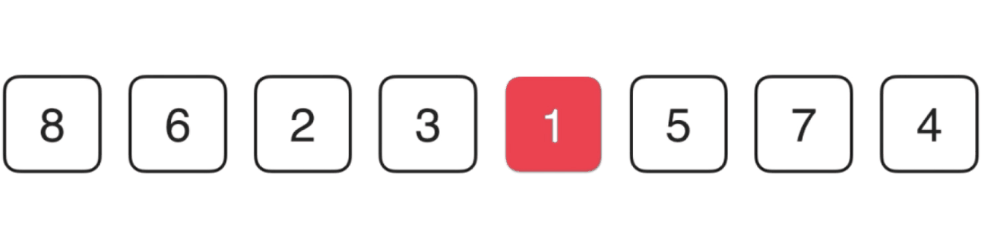
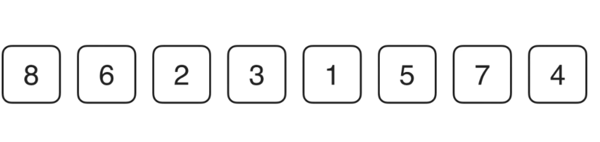
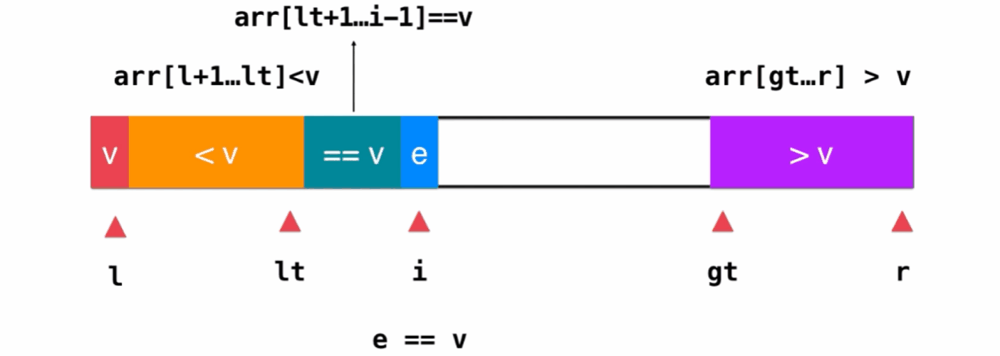
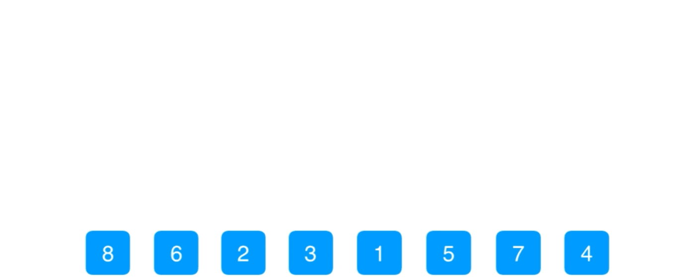
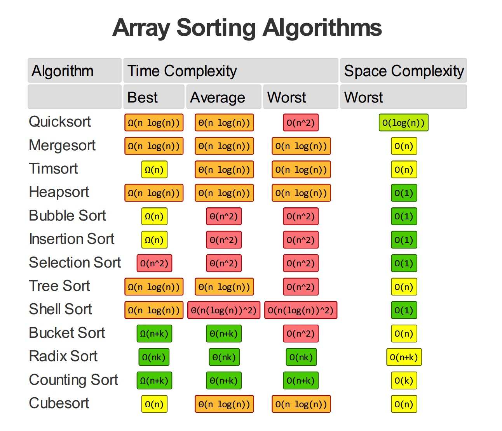

# 1 排序

## 1.1 选择排序

​	简单选择排序是最简单直观的一种算法，基本思想为每一趟从待排序的数据元素中选择最小（或最大）的一个元素作为首元素，直到所有元素排完为止，简单选择排序是不稳定排序。

　　在算法实现时，每一趟确定最小元素的时候会通过不断地比较交换来使得首位置为当前最小，交换是个比较耗时的操作。其实我们很容易发现，在还未完全确定当前最小元素之前，这些交换都是无意义的。我们可以通过设置一个变量min，每一次比较仅存储较小元素的数组下标，当轮循环结束之后，那这个变量存储的就是当前最小元素的下标，此时再执行交换操作即可。代码实现很简单，一起来看下。

~~~go
func Select(arr []int)  {
	var min int
	for i := 0; i< len(arr); i++ {
		min = i
		for j:=i+1; j< len(arr);j++  {
			if arr[j]<arr[min] {
				min = j
			}
		}
		arr[i] ,arr[min] = arr[min] , arr[i]
	}
}
~~~



**特点：**

- 运行时间和输入无关
- 移动数据最少

## 1.2 插入排序

​	从第一个元素开始，取下一个元素比较后实现排序，形成新的数组，再取第三个元素与该数组比较，比较时从该数组的最后一位开始比较，若新元素比与其比较的元素小，则将该比较的元素后移以为，直到新元素比该数组左边找到其应该插入的位置。代码实现如下

~~~go
func Sort(arr []int) {
	var j int

	for i := 1; i < len(arr); i++ {
		for j = i; j > 0 && arr[j-1] > arr[i]; j-- {
			arr[j], arr[i] = arr[i], arr[j-1]
		}
	}
}
~~~

**特点：**

- 适合小规模数组
- 非随机数据（部分有序）效率会高



## 1.3 希尔排序

​	该方法的基本思想是：先将整个待排元素序列分割成若干个子序列（由相隔某个“增量”的元素组成的）分别进行直接插入排序，然后依次缩减增量再进行排序，待整个序列中的元素基本有序（增量足够小）时，再对全体元素进行一次直接插入排序。因为直接插入排序在元素基本有序的情况下（接近最好情况），效率是很高的，因此希尔排序在时间效率上比前两种方法有较大提高。

~~~go
func Sort(c []int) {
	n := len(c)
	h := 1

	for h < n/3 {
		h = 3*h + 1
	}

	for h >= 1 {
		for i := h; i < n; i++ {
			for j := i; j >= h && c[j] < c[j-h]; j -= h {
				c[i], c[j] = c[j], c[i]
			}
		}
		h = h / 3
	}
}

~~~


## 1.4 三路快排

基本思路和快排一样，多的一路是维护数组中和被比较元素相等的元素

~~~go
func sortThreeWays(arr []int, l, r int) {
	if r-l <= 15 {
		insertion.Sort(arr[l : r+1])
		return
	}
	temp:=rand.Int()%(r-l+1)+l
	example.Swap(arr,l,temp)
	v := arr[l]
	lt := l
	gt := r + 1
	i := l + 1

	for i < gt {
		if arr[i] < v {
			example.Swap(arr, i, lt+1)
			lt++
			i++
		} else {
			if arr[i] > v {
				example.Swap(arr, i, gt-1)
				gt--
			} else {
				i++
			}
		}
	}

	example.Swap(arr, l, lt)

	sortThreeWays(arr, l, lt-1)
	sortThreeWays(arr, gt, r)
}
~~~



## 1.5 归并排序

### 1.5.1 自底向上的归并

自底向上的归并只需要迭代就可以了

~~~go
func merge(c []int, lo, mid, hi int) {

	if hi-lo <= 15 {
		insertion.Sort(c[lo : hi+1])
		return
	}

	// 将c数组copy一份到aux中
	aux := make([]int, len(c))
	copy(aux, c)

	i, j := lo, mid+1

	for k := lo; k <= hi; k++ {
		if i > mid {
			c[k] = aux[j]
			j++
		} else if j > hi {
			c[k] = aux[i]
			i++
		} else if aux[j] < aux[i] {
			c[k] = aux[j]
			j++
		} else {
			c[k] = aux[i]
			i++
		}
	}
}


func UpSort(c []int) {
	le := len(c)

	for sz := 1; sz < le; sz = sz + sz {

		//这有个越界问题
		for lo := 0; lo +sz < le; lo += sz + sz {
			merge(c, lo, lo+sz-1, int(math.Min(float64(lo+sz+sz-1), float64(le-1))))
		}
	}
}
~~~




# 2 性能分析

## 2.1 运动轨迹

```
// 原数据
[1 2 3 1 0]

=== RUN   TestShellSort
源数据：[1 6 7 0 1 3 1 2 0 0]
共循环13次
第1交换：[1 3 7 0 1 6 1 2 0 0]
第2交换：[1 3 1 0 1 6 7 2 0 0]
第3交换：[1 3 1 0 0 6 7 2 1 0]
第4交换：[0 3 1 0 1 6 7 2 1 0]
第5交换：[0 3 1 0 1 0 7 2 1 6]
第6交换：[0 0 1 0 1 3 7 2 1 6]
第7交换：[0 0 0 1 1 3 7 2 1 6]
第8交换：[0 0 0 1 1 3 2 7 1 6]
第9交换：[0 0 0 1 1 2 3 7 1 6]
第10交换：[0 0 0 1 1 2 3 1 7 6]
第11交换：[0 0 0 1 1 2 1 3 7 6]
第12交换：[0 0 0 1 1 1 2 3 7 6]
第13交换：[0 0 0 1 1 1 2 3 6 7]

=== RUN   TestInsertion
源数据：[1 6 7 0 1 3 1 2 0 0]
共循环27次
第1交换：[1 6 0 7 1 3 1 2 0 0]
第2交换：[1 0 6 7 1 3 1 2 0 0]
第3交换：[0 1 6 7 1 3 1 2 0 0]
第4交换：[0 1 6 1 7 3 1 2 0 0]
第5交换：[0 1 1 6 7 3 1 2 0 0]
第6交换：[0 1 1 6 3 7 1 2 0 0]
第7交换：[0 1 1 3 6 7 1 2 0 0]
第8交换：[0 1 1 3 6 1 7 2 0 0]
第9交换：[0 1 1 3 1 6 7 2 0 0]
第10交换：[0 1 1 1 3 6 7 2 0 0]
第11交换：[0 1 1 1 3 6 2 7 0 0]
第12交换：[0 1 1 1 3 2 6 7 0 0]
第13交换：[0 1 1 1 2 3 6 7 0 0]
第14交换：[0 1 1 1 2 3 6 0 7 0]
第15交换：[0 1 1 1 2 3 0 6 7 0]
第16交换：[0 1 1 1 2 0 3 6 7 0]
第17交换：[0 1 1 1 0 2 3 6 7 0]
第18交换：[0 1 1 0 1 2 3 6 7 0]
第19交换：[0 1 0 1 1 2 3 6 7 0]
第20交换：[0 0 1 1 1 2 3 6 7 0]
第21交换：[0 0 1 1 1 2 3 6 0 7]
第22交换：[0 0 1 1 1 2 3 0 6 7]
第23交换：[0 0 1 1 1 2 0 3 6 7]
第24交换：[0 0 1 1 1 0 2 3 6 7]
第25交换：[0 0 1 1 0 1 2 3 6 7]
第26交换：[0 0 1 0 1 1 2 3 6 7]
第27交换：[0 0 0 1 1 1 2 3 6 7]

=== RUN   TestSelection
源数据：[1 6 7 0 1 3 1 2 0 0]
共循环10次
第1交换：[0 6 7 1 1 3 1 2 0 0]
第2交换：[0 0 7 1 1 3 1 2 6 0]
第3交换：[0 0 0 1 1 3 1 2 6 7]
第4交换：[0 0 0 1 1 3 1 2 6 7]
第5交换：[0 0 0 1 1 3 1 2 6 7]
第6交换：[0 0 0 1 1 1 3 2 6 7]
第7交换：[0 0 0 1 1 1 2 3 6 7]
第8交换：[0 0 0 1 1 1 2 3 6 7]
第9交换：[0 0 0 1 1 1 2 3 6 7]
第10交换：[0 0 0 1 1 1 2 3 6 7]
```

## 2.2 性能分析

```
// 普通测试

=== RUN   TestMergeUpSort
--- PASS: TestMergeUpSort (10.92s)
=== RUN   TestMergeDownSort
--- PASS: TestMergeDownSort (39.70s)
=== RUN   TestShellSort
--- PASS: TestShellSort (0.02s)
=== RUN   TestInsertion
--- PASS: TestInsertion (4.63s)
=== RUN   TestSelection
--- PASS: TestSelection (5.60s)

// 基准测试

goos: darwin
goarch: amd64
pkg: algorithm/sort/tests
BenchmarkMergeUpSort-4     	       1	12255382351 ns/op
BenchmarkMergeDownSort-4   	       1	45450033789 ns/op
BenchmarkShellSort-4       	1000000000	         0.00854 ns/op
BenchmarkInsertion-4       	1000000000	         0.00887 ns/op
BenchmarkSelection-4       	       1	5804200109 ns/op
```

## 2.3 排序成本模型

在研究排序算法时，我们需要计算比较和交换的数量。对于不交换元素的算法，需要统计访问数组次数。



# 3 优先队列

## 3.1 必要操作

- 删除最大元素
- 插入元素

优先队列是一种抽象数据类型

# 4 问题

## 4.1 纸牌排序

**问题：** 

说说你会如何将一副扑克牌按花色排序（花色顺序为黑桃、红桃、梅花、方片），限制条件是所有牌都是背面朝上排成一列，而你一次只能翻看两张牌或交换两张牌（保持背面朝上）

**解答：**

一次只能比较某两个元素而实现排序，使用插入排序和冒泡排序

### 出列排序

说说你会如何将一副扑克牌排序，限制条件是只能查看最上面的两张牌，交换最上面的两张牌，或是将最上面的一张牌放到这一摞牌的最下面。

**问题：** 

选择排序即每次选出该扑克牌中最大的那个牌出来。具体做法如下：

**解答：**

1. 比较最上面的两张牌，如果第一张牌比第二张牌大，就交换这两张牌，否则保持这两张牌的顺序不变，
2. 将第一张牌放入牌底，随着是同样的操作——比较最上面的两张牌。经过length-1次这样的操作后，最上面的牌肯定是最大的一张牌了，此时不需要做任何的比较，直接把此牌放入牌底。
3. 第一步中已经找出了最大的一张牌并且放入了牌底，那么接下来还是同样的做法，就是在最上面的length-1张牌中，找出最大的一张牌，再放入排序，经过反复的这样操作后，可以实现有序，最大的牌在最上面，而最小的牌在最下面。

### 昂贵的交换

**问题：**

一家货运公司的一位职员得到了一项任务，需要将若干大货箱按照发货时间摆放。比较发货时间很容易（对照标签即可），但将两个货箱交换位置则很困难（移动麻烦）。仓库已经快满了，只有一个空闲的仓位。这位职员应该使用哪种排序算法呢？ 

**解答：**

选择排序算法是多比较，少交换

## 名词解释

### 指针排序

我们只处理元素的引用而不移动数据本身

### 不可变的键

如果在排序后用例还能够修改键值，那么数组就很可能不再是有序的了。类似，优先队列在用例能够修改键值的情况下也不太可能正常工作。在Java中，可以用不可变的数据类型作为键来避免这个同题。大多数你可能用作键的数据类型，例如String、Integer、Double和File都是
不可变的。

### 廉价的交换

使用引用的另一个好处是我们不必移动整个元素。对于元素大而键小的数组来说这带来的节约是巨大的，因为比较只需要访问元素的一小部分，而排序过程中大部分元素都不会被访问到^对于几乎任意大小的元素，使用引用使得在一般情况下交换的成本和比较的成本几乎相同(代价是需要额外的空间存储这些引用)。如果键值很长，那么交换的成本甚至会低于比较的成本。

### 多种排序方法

### 多键数组

一个元素的多种属性都可能被用作排序的键

### 使用比较器实现优先队列

## 最佳选择

**快速排序是最快的通用排序算法**

快速排序之所以最快是因为它的内循环中的指令很少(而且它还能利用缓存，因为 它总是顺序地访问数据)，所以它的运行时间的增长数量级为〜cNlgN，而这里的c比其他线性对数级别的排序算法的相应常数都要小。在使用三向切分之后，快速排序对于实际应用中可能出现的某些分布的输入变成线性级别的了，而其他的排序算法则仍然需要线性对数时间


