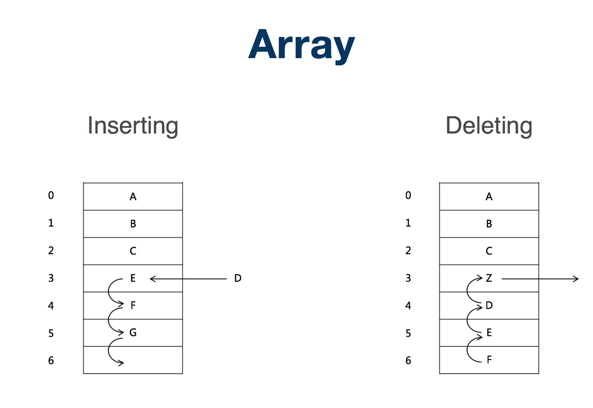

# 1 数组

## 1.1 数组基本结构


## 1.2 数组基本操作



## 1.3 时间复杂度

- 查询：O(1)
- 插入：O(n)
- 删除：O(n)

## 1.4 数组的特点

1. 在内存中，数组是一块连续的区域
2. 数组需要预留空间，在使用前要先申请占内存的大小，可能会浪费内存空间。 
3. 插入数据和删除数据效率低，插入数据时，这个位置后面的数据在内存中都要向后移。
4. 查询效率很高。

# 2 链表

## 2.1 单向链表

### 2.1.1 单向链表基本结构


### 2.1.2 单向链表变形

第一个元素增加了尾指针


### 2.1.3 单向链表操作


## 2.2 双向链表

### 2.2.1 双向链表结构


## 2.2 时间复杂度

- 查询：O(n)
- 删除：O(1)
- 插入：O(1)

# 3 实战题目

## 3.1 反转链表

[206. 反转链表](https://leetcode-cn.com/problems/reverse-linked-list/)

**思路一**

利用递归的思想，互换位置

**思路二**

利用迭代的思想，将其互换位置

### 3.1.1 递归

```go
package list

type ListNode struct {
	Val  int
	Next *ListNode
}

func reverseList(head *ListNode) *ListNode {

	if head == nil || head.Next == nil {
		return head
	}

	Linked := reverseList(head.Next)

	head.Next.Next = head
	head.Next = nil

	return Linked
}
```

### 3.1.2 迭代

```go
package list

type ListNode struct {
	Val  int
	Next *ListNode
}

func reverseList(head *ListNode) *ListNode {
	linked := new(ListNode)
	cur, prev := head, linked
	for cur != nil {
		cur.Next, prev, cur = prev, cur, cur.Next
	}
	return prev
}

```

## 3.2 判断链表是否有环

[环形链表](https://leetcode-cn.com/problems/linked-list-cycle/)

**思路一**

1. 遍历整个链表，如果不存在则加入map
2. 判断如果存在则直接`return true`，否则将其加入到map中

**思路二**

1. 设置两个指针quick和slow
2. quick每次走两步，slow每次走一步
3. 如果两个相等，则证明有环

### 3.2.1 Map直接查找

```go
type ListNode struct {
	Val  int
	Next *ListNode
}

func hasCycle(head *ListNode) bool {
	if head == nil {
		return false
	}
	headMap := map[*ListNode]bool{}

	p := head

	for p != nil {
		if _, ok := headMap[p]; ok {
			return true
		}
		headMap[p] = true
		p = p.Next
	}
	return false
}
```

**问题**

以下代码，为什么代码B会快？

```go

	// 代码A
	for head != nil {
		if _, ok := headMap[head]; ok {
			return true
		}
		headMap[head] = true
		head = head.Next
	}
	return false

    // 代码B
	p := head

	for p != nil {
		if _, ok := headMap[p]; ok {
			return true
		}
		headMap[p] = true
		p = p.Next
	}
	return false
```

**原因**

1. Go中所有的都是按值传递，对于复杂类型，传的是指针的拷贝

```go
func main() {
    var m map[string]int
    m = map[string]int{"one": 1, "two": 2}
    n := m
    fmt.Printf("%p\n", &m) //0xc000074018
    fmt.Printf("%p\n", &n) //0xc000074020
    fmt.Println(m)         // map[two:2 one:1]
    fmt.Println(n)         //map[one:1 two:2]
    changeMap(m)
    fmt.Printf("%p\n", &m) //0xc000074018
    fmt.Printf("%p\n", &n) //0xc000074020
    fmt.Println(m)         //map[one:1 two:2 three:3]
    fmt.Println(n)         //map[one:1 two:2 three:3]
}
func changeMap(m map[string]int) {
    m["three"] = 3
    fmt.Printf("changeMap func %p\n", m) //changeMap func 0xc000060240
}
```

2. 直接传指针 也是传指针的拷贝

```go
func main() {
    var m map[string]int
    m = map[string]int{"one": 1, "two": 2}
    n := m
    fmt.Printf("%p\n", &m) //0xc000074018
    fmt.Printf("%p\n", &n) //0xc000074020
    fmt.Println(m)         // map[two:2 one:1]
    fmt.Println(n)         //map[one:1 two:2]
    changeMap(&m)
    fmt.Printf("%p\n", &m) //0xc000074018
    fmt.Printf("%p\n", &n) //0xc000074020
    fmt.Println(m)         //map[one:1 two:2 three:3]
    fmt.Println(n)         //map[two:2 three:3 one:1]
}
func changeMap(m *map[string]int) {
    //m["three"] = 3 //这种方式会报错 invalid operation: m["three"] (type *map[string]int does not support indexing)
    (*m)["three"] = 3                    //正确
    fmt.Printf("changeMap func %p\n", m) //changeMap func 0x0
}
```

[参考文章 - go 指针和内存分配详解](https://segmentfault.com/a/1190000017473672)

### 3.2.2 快慢指针

```go

type ListNode struct {
	Val  int
	Next *ListNode
}

func hasCycle(head *ListNode) bool {
	if head == nil {
		return false
	}
	
	p := head
	quick := p.Next

	for p != nil && quick != nil && quick.Next != nil {
		quick = quick.Next.Next

		if quick == p {
			return true
		}

		p = p.Next
	}

	return false
}

```

## 3.3 环形链表 II

[环形链表 II](https://leetcode-cn.com/problems/linked-list-cycle-ii/)

## 3.4 两两交换链表中的节点

[两两交换链表中的节点](https://leetcode-cn.com/problems/swap-nodes-in-pairs/)

## 3.5 K 个一组翻转链表

[K 个一组翻转链表](https://leetcode-cn.com/problems/reverse-nodes-in-k-group/)
