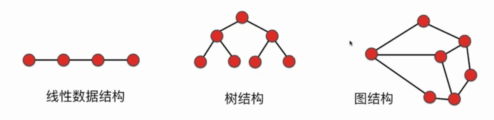
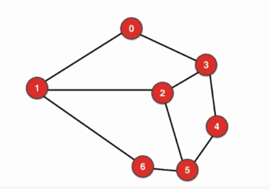
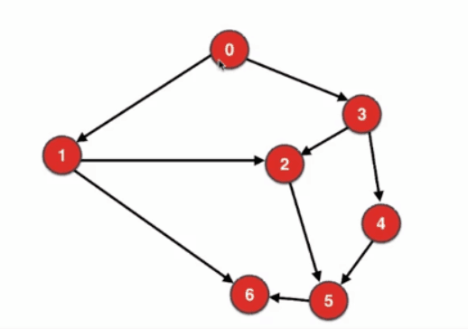

# 1 图的表示

在计算机的世界中树结构大概可以分为下面几种，线性结构，树结构，图结构

而到了计算机中我们采用什么样的方式存储这些结构，这就是在计算机中怎么表示的问题。

## 1.1 图的分类

对于一个图来说上面一个一个点叫做顶点(Vertex)，每一个定点由0开始的序号表示，每个顶点都可以代表着不同的信息。有的顶点与顶点之间是相连的，相连的线叫做边(Edge)，一个图的数据结构的表示也就只需要表示这两部分。

### 1.1.1 边有没有方向

**无向图(undirected Graph)：** *无向图表示的是顶点和顶点之间是没有方向的，任意两个相连的顶点之间都可以互通，上图*

**有向图(Directed Graph)：** *有向图则刚好相反，顶点和顶点之间是有方向的，顶点之间的互通只能按照顶点之间的连接方向进行互通，如下图。*

对于不同的场景，是需要使用不同的图结构进行建模，比如对北京地铁进行建模就需要使用无向图建模。因为回龙观既可以到霍营，霍营也可以到回龙观。

### 1.1.2 边有没有权值

**有权图：** *边上有权值称为有全图。*

**无权图**： *边上没有权值称为无权图*。

`权值`的大小代表了顶点和顶点之间的关联程度，比如在社交网络中，一个顶点对不同的顶点就有不同的关注程度，根据建模的场景，权值代表的信息是不同的。

根据边有没有方向，边上有没权值，我们可以把图划分为四类。**无向无权图、有向无权图、无向有权图、有向有权图**

|      |    无向    |    有向    |
| :--: | :--------: | :--------: |
| 无权 | 无向无权图 | 有向无权图 |
| 有权 | 无向有权图 | 有向有权图 |

