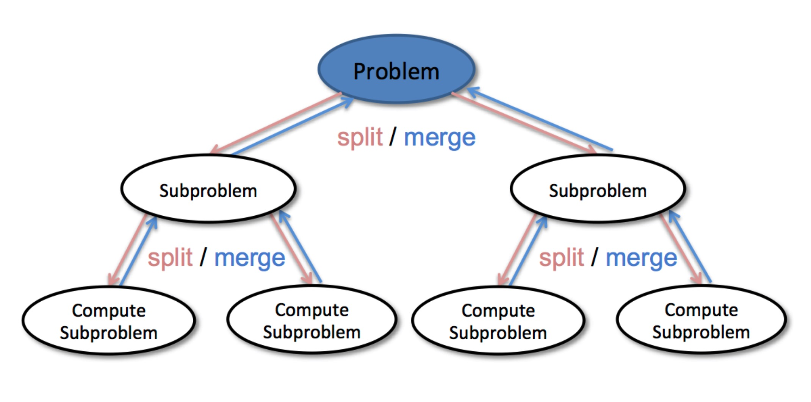

# 递归&分治

## 递归

### 计算 `n!`

`n! = 1 * 2 * 3 * ... * n`

```go
func recursion(n int) int {
	if n == 1 {
		return 1
	}
	return n * recursion(n-1)
}
```


### 斐波拉切数组（Fibonacci array）

```
1, 1, 2, 3, 5, 13, 21, 34, ...
F(n) = F(n-1) + F(n-2)
```

```go
func fib(n int) int {
	if n == 1 || n == 0 {
		return n
	}
	return fib(n-2) + fib(n-1)
}
```


## 分治

分治的核心思想就是将一个问题拆解为若干个子问题，在进行合并




# 实战列表

## 计算 x 的 n 次幂函数

[即计算 x 的 n 次幂函数](https://leetcode-cn.com/problems/powx-n/)

## 最大子序和

[最大子序和](https://leetcode-cn.com/problems/maximum-subarray/)

## 多数元素

[多数元素](https://leetcode-cn.com/problems/majority-element/)

## 有效的字母异位词

[有效的字母异位词](https://leetcode-cn.com/problems/valid-anagram/)

## 找到字符串中所有字母异位词

[找到字符串中所有字母异位词](https://leetcode-cn.com/problems/find-all-anagrams-in-a-string/)
