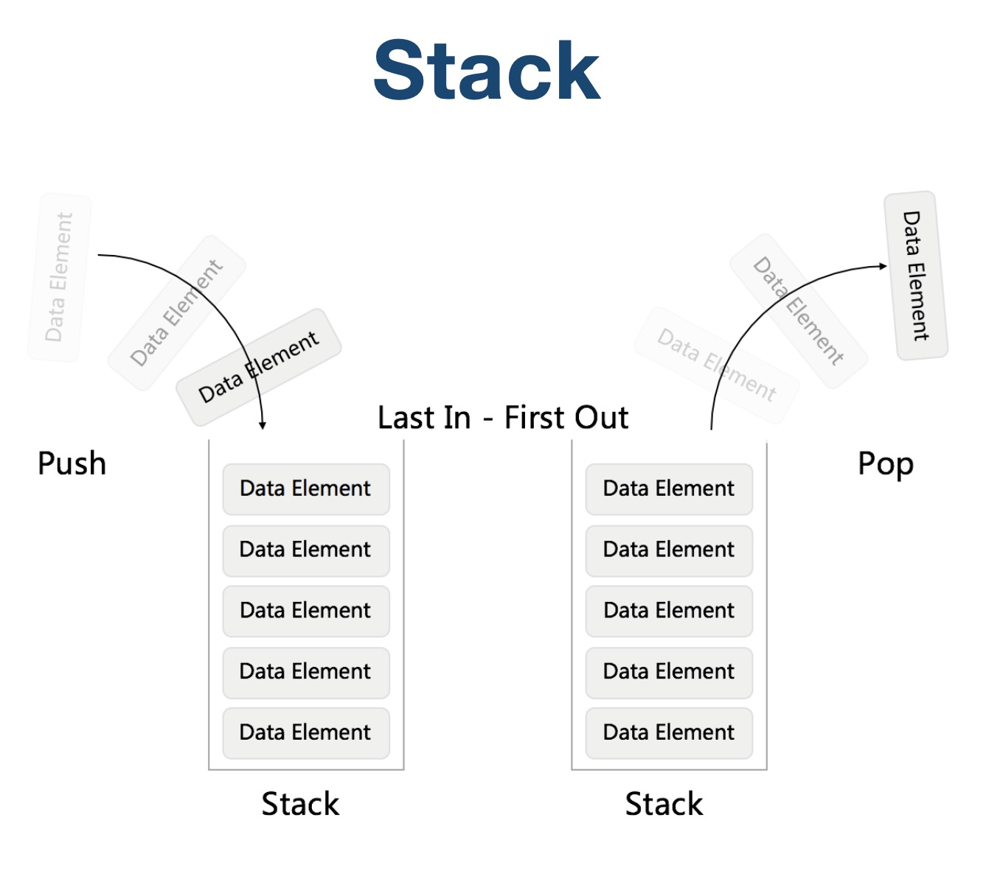
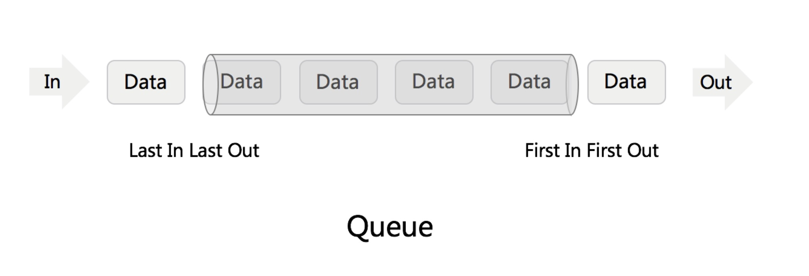
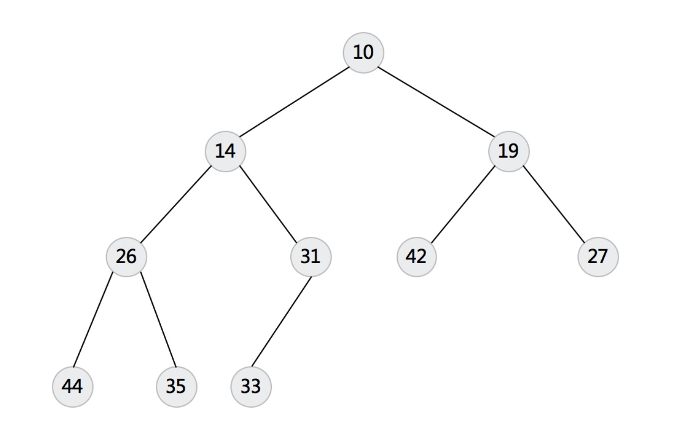
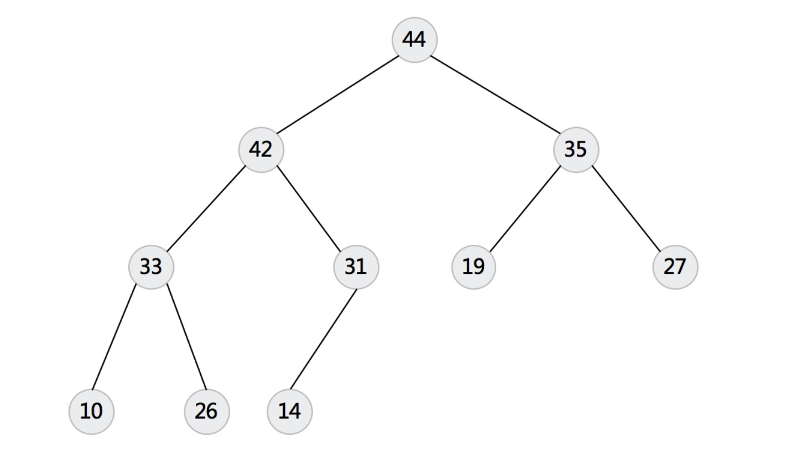

# 栈&队列

## 1 栈

先进后出

## 2 队列

先进先出

## 3 优先队列

[堆](https://en.wikipedia.org/wiki/Heap_(data_structure))

### 3.1 最小堆

### 3.2 最大堆

## 4 实战题目

### 4.1 用栈实现队列

[用栈实现队列](https://leetcode-cn.com/problems/implement-queue-using-stacks/)

### 4.2 用队列实现栈

[用队列实现栈](https://leetcode-cn.com/problems/implement-stack-using-queues/)

### 4.3 有效括号

[有效括号](https://leetcode-cn.com/problems/valid-parentheses/)

### 4.4 数据流中的第K大元素

[数据流中的第K大元素](https://leetcode-cn.com/problems/kth-largest-element-in-a-stream/)

### 4.5 滑动窗口最大值

[滑动窗口最大值](https://leetcode-cn.com/problems/sliding-window-maximum/)