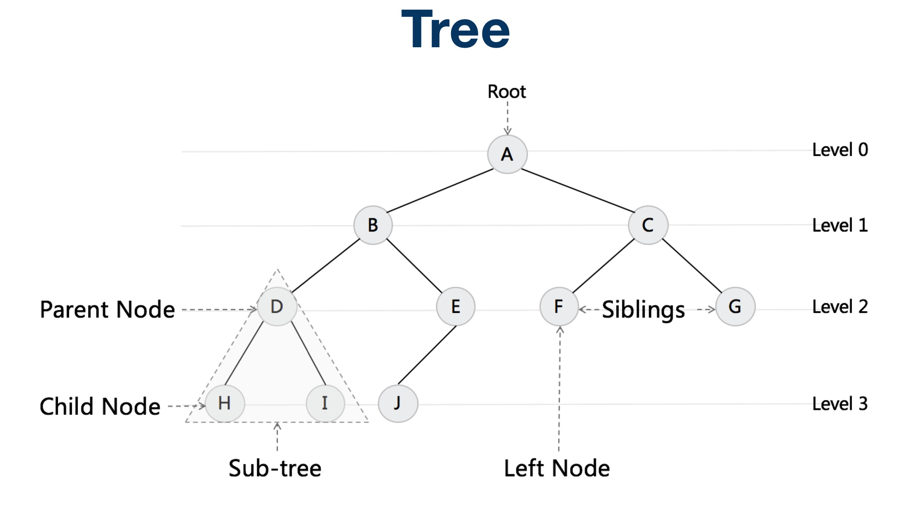
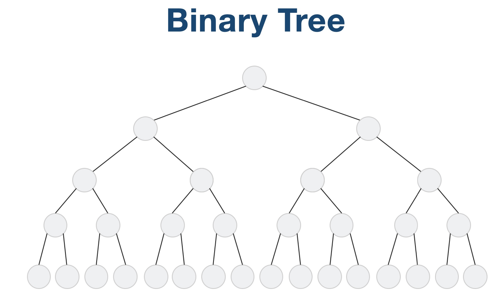
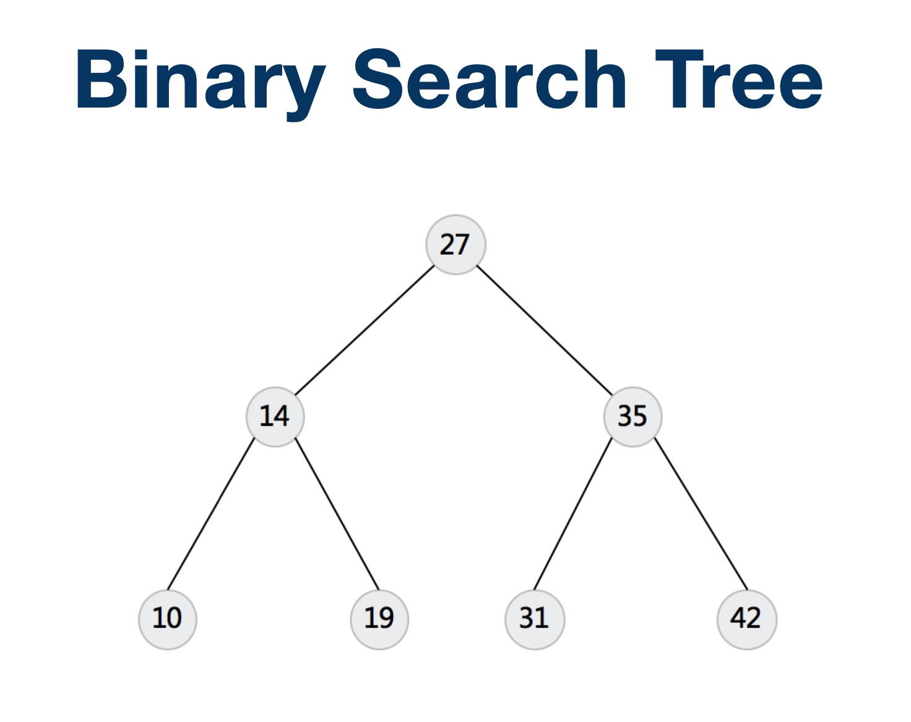
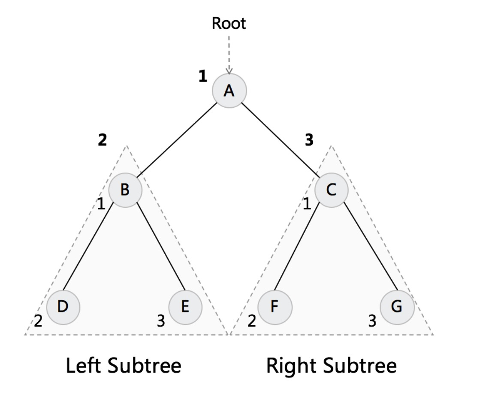
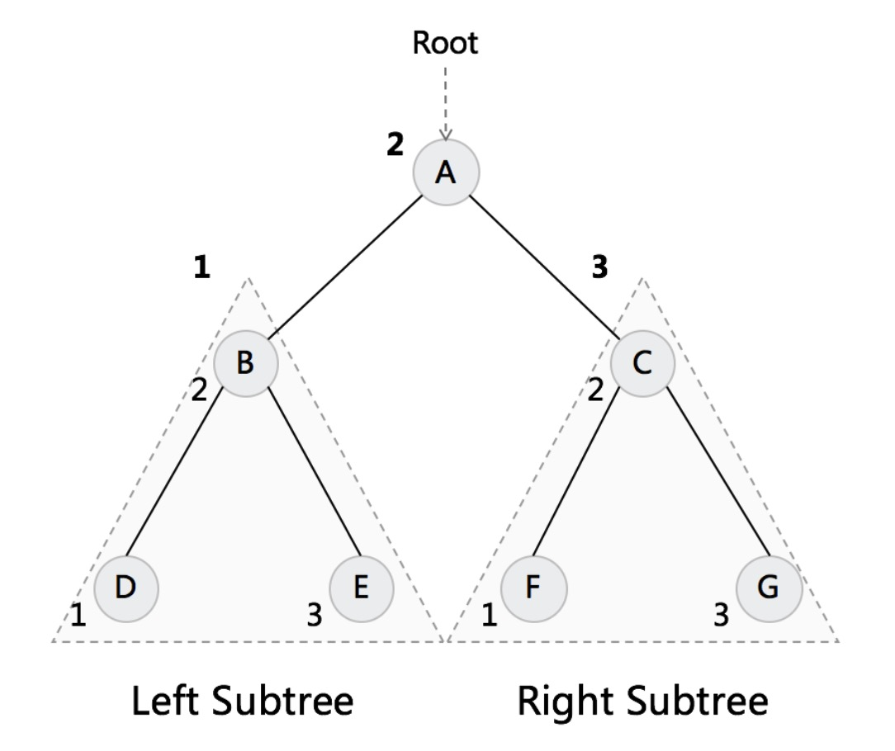
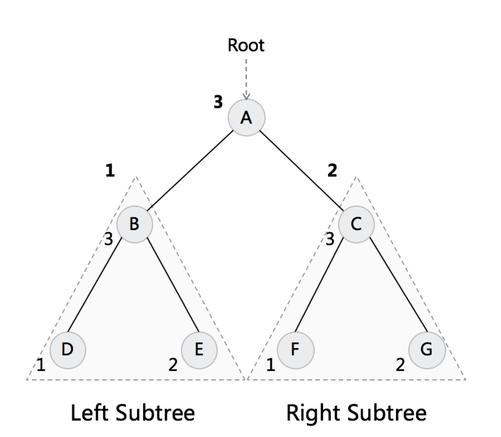

# 树

## ⼆叉搜索树(英语:Binary Search Tree)

### 别名

- 有序⼆叉树(ordered binary tree)
- 排序二叉树(sorted binary tree)

### 特点

是指一棵空树或者具有下列性质的二叉树:

1. 若任意节点的左子树不空，则左子树上所有结点的值均⼩于它的根结点的值
2. 若任意节点的右⼦树不空，则右子树上所有结点的值均大于它的根结点的值
3. 任意节点的左、右子树也分别为⼆叉查找树。

# 二叉树遍历

## 前序遍历

根-左-右

## 中序遍历

左-根-右

## 后序遍历

左-右-根

# 题目实战

## 验证二叉搜索树

[验证二叉搜索树](https://leetcode-cn.com/problems/validate-binary-search-tree/)

## 二叉搜索树的最近公共祖先

[二叉搜索树的最近公共祖先](https://leetcode-cn.com/problems/lowest-common-ancestor-of-a-binary-search-tree/)

## 二叉树的最近公共祖先

[二叉树的最近公共祖先](https://leetcode-cn.com/problems/lowest-common-ancestor-of-a-binary-tree/)