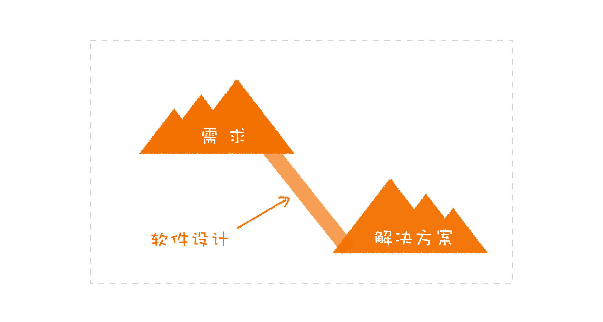
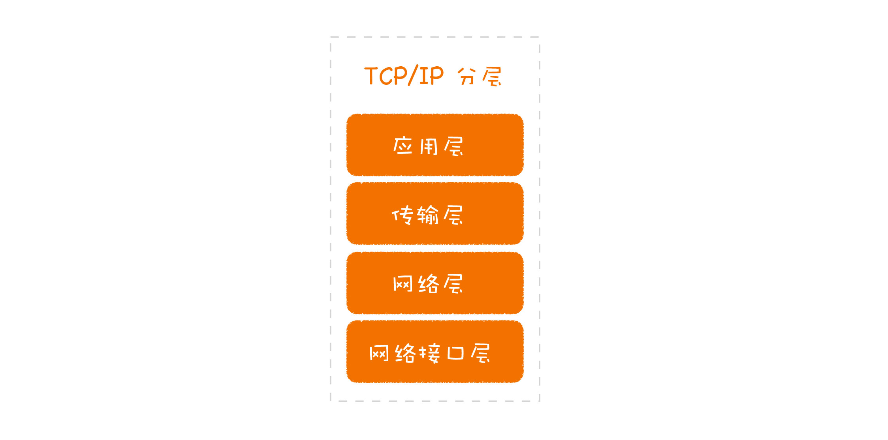
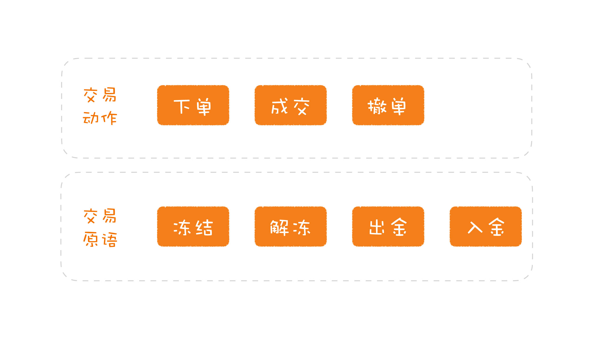
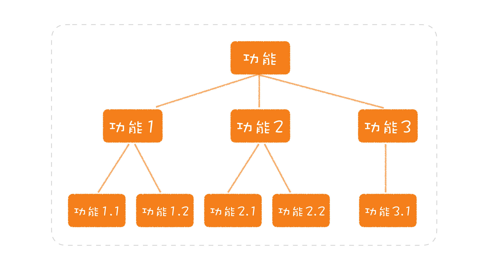
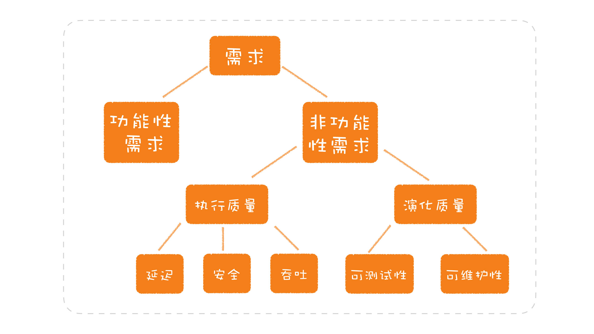

# 概念

[TOC]

---

## 软件设计到底是什么

每个人对事物都有这不同的理解，可能关注的侧重点不同，有人会关注技术实现；有人会关注框架选型；有人会关注设计模式灯。但是软件开发本身是为了解决由需求带来的各种问题，而解决的结果是一个可以运行的交付物。比如，我们在线购物的需求，是通过电商平台这个方案解决的。

### 软件开发特点

* 时间周期长
* 投入人力多
* 认知不同，沟通成本上升

通过以上特点，在开发过程中就需要建立统一的模型，从而达到认知统一。这种统一的结构就是模型，而软件设计就是要构建出一套模型。

### 设计要素

高内聚、低耦合

### 两个案例

#### 网络模型案例

通过TPC/IP分层来看一个软件内部，模型也可以是分层的。

#### 交易系统案例

在分析了主要的交易动作之后，我提出了一个交易原语的概念，包括资产冻结、解冻、出金、入金等少数几个动作。然后，把原先的交易动作变成了原语的组合。比如，下单是资产冻结，成交是不同账户的出金和入金，撤单则是资产解冻。

### 总结

没有一个统一的规范，每一个项目上的新成员都会痛斥一番前人的不负责任。然后，新的人准备另起炉灶，增加一些新东西。这种场景你是不是很熟悉呢？混乱通常就是这样开始的。

* 模型：是一个软件的骨架，是一个软件之所以是这个软件的核心。模型的粒度可大可小。我们所说的“高内聚、低耦合”指的就是对模型的要求，一个好的模型可以有效地隐藏细节，让开发者易于理解。模型是分层的，可以不断地叠加，基于一个基础的模型去构建上一层的模型，计算机世界就是这样一点点构建出来的。
* 规范：就是限定了什么样的需求应该以怎样的方式去完成。它对于维系软件长期演化至关重要。关于规范，常见的两种问题是：一个项目缺乏显式的、统一的规范；规范不符合软件设计原则。
* 模型与规范，二者相辅相成，一个项目最初建立起的模型，往往是要符合一定规范的，而规范的制定也有赖于模型。

<<<<<<< HEAD
[回到顶部](#概念)

---

## 分离关注点（软件设计至关重要的第一步）

* 一般解决问题的常用手段是分而治之，先将问题拆解，当每个问题解决后，在进行组装。
* 分解问题时，最重要的是需要考虑粒度问题，避免技术和业务被混在了一起

### 清结算案例

清算系统中上游系统以推送的方式向这个系统发消息。在原本的实现中，开发人员发现这个过程可能会丢消息，于是，他们设计了一个补偿机制。因为推送过来的数据是之前由这个系统发出去的，它本身有这些数据的初始信息，于是，开发人员就在数据库里增加了一个状态，记录消息返回的情况。一旦发现丢消息了，这个系统就会访问上游系统的接口，将丢失的数据请求回来。

带来的问题：业务量增加，失败率增加，数据库访问量增加

优化方案：

1. 对整体建模，可以将整个系统分为业务层、数据传输层
2. 业务层只关注业务逻辑处理，不关注数据丢失，数据丢失通过数据传输层进行保证和补偿

### 分离关注点的常用方案

* 按功能拆分

在真实的项目中，项目复杂度往往会很高，不一定能够按照纯功能纬度进行划分。往往是会穿插多个纬度的场景进行处理，所以需要将每一个纬度当成一个关注点进行拆分

### 思考

1. 我们业务中是否是需要编写多线程？
2. 业务是否是需要分库分表？
3. 需要考虑分布式事物么？

诸如此类的，不妨在做设计之前，可以先思考一下，我们写业务时，需要过多的考虑技术问题么？

### 总结

大多数系统的设计做得不够好，问题常常出现在分解这步就没做好。常见的分解问题就是分解的粒度太大，把各种维度混淆在一起。在设计中，将一个模块的不同维度分开，有一个专门的说法，叫分离关注点。

分离关注点，发现的关注点越多越好，粒度越小越好。

[回到顶部](#概念)

---

## 可测试性（一个影响软件设计的重要因素）

软件开发要解决的问题是从需求而来。需求包括两大类，第一类是功能性需求，也就是要完成怎样的业务功能；第二类是非功能性需求，是业务功能之外的一些需求。

非功能性需求也被分为两大类，一类称为执行质量（Execution qualities），你所熟悉的吞吐、延迟、安全就属于这一类，它们都是可以在运行时通过运维手段被观察到的；而另一类称为演化质量（Evolution qualities），它们内含于一个软件的结构之中，包括可测试性、可维护性、可扩展性等。

### 调用数据库实例

在通常的架构中，服务会调用数据库访问的代码。如果是不考虑测试的做法，代码可能写成这样：

~~~java
class ProductService {
  // 访问数据库的对象
  private ProduceRepository repository = new ProductRepository();
  
  public Product find(final long id) {
    return this.repository.find(id);
  }
}
~~~

由于测试并不关心如何链接数据库是否访问正确，只关心服务逻辑是不是写正确了，如果我考虑了可测试性，服务的依赖就变成了一个数据访问的接口：

~~~java
class ProductService {
  // 访问数据库的对象
  private ProduceRepository repository;
  
  public ProductService(final ProduceRepository repository) {
    this.repository = repository;
  }
  
  public Product find(final long id) {
    return this.repository.find(id);
  }
}
~~~

然后通过模拟接口的Mock框架进行参数伪造

### 总结

在软件设计中，可测试性常常被人忽视，结果造成了很多模块的不可测，由此引发了很多技术债。所以，在设计中就要充分考虑可测试性。

所以在进行技术方案设计时，一定需要加上该系统如何进行测试

[回到顶部](#概念)
