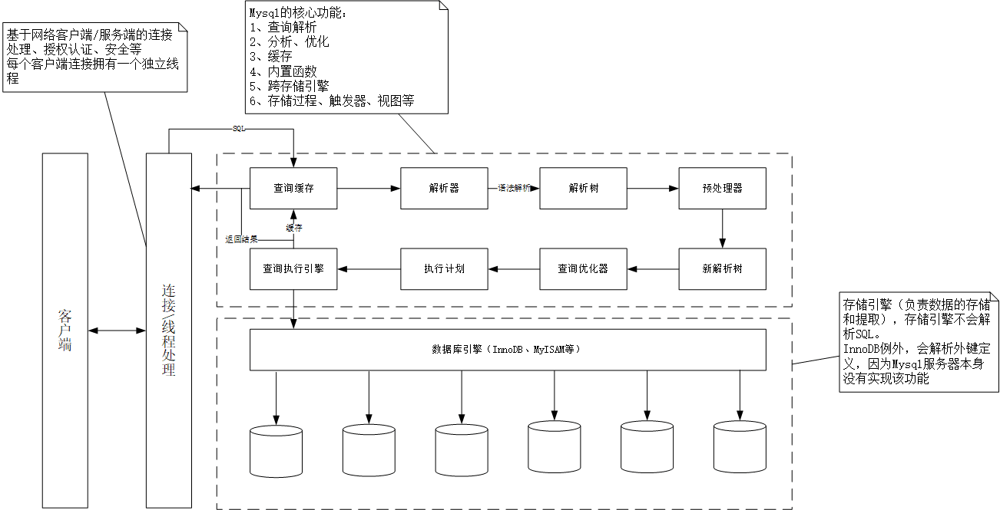

# MySQL架构



## 1 连接管理与安全性

每个客户端都会在MySQL进程中拥有一个线程，该连接的查询只会在这个单独的线程中执行。MySQL5.5支持了线程池插件，使用线程池中的少量线程服务大量链接。

1. 普通MySQL认证连接：`mysql -h127.0.0.1 -uroot -proot -P3306 -Ddatabase`
2. 安全套接字（SSL）连接（MySQL5.7之后默认使用SSL）
3. X.509证书认证

当认证完成之后，MySQL会检验该客户端是否具有执行某个特定查询的权限。

## 2 优化与执行

- 当缓存中能够找到对应的查询，服务器将不会执行查询过程，直接返回缓存中的结果集
- MySQL解析查询，构建内部数据结构（解析树），重写查询、表的读取顺序、选择索引等。
- 用户可以通过关键字提示优化器，影响决策过程。

## 3 并发控制

### 3.1 服务器层

`LOCK TABLES`和`UNLOCK TABLES`是在服务器层实现的，和存储引擎无关。

### 3.2 存储引擎层

#### 3.2.1 读写锁

- 共享锁（读锁）：同时读取资源互不干扰
- 排它锁（写锁）：只能一个用户进行写入

#### 3.2.2 锁粒度 （在锁的开销和数据的安全之间寻求平衡）

- 尽量锁定需要修改的部分数据
- 只会对修改的数据片进行精确的锁定
- 锁定的数据越少，则系统的并发程度越高

**加锁需要消耗资源的原因：** 获得锁、检查锁是否已经解除、释放锁等。当系统花费大量时间管理锁，而不是存取数据时，系统性能将会受到影响。

**锁策略：** 在开销和数据安全之间寻求平衡，也会影响性能。

#### 3.2.3 表锁

- 表锁是MySQL最基本的锁策略，并且开销最小，会锁定整张表。
- 当一个用户对表进行写操作（增、删、改等），需要先获得写锁，会阻碍其他的用户对该表的所有读写操作。没有写锁时，其他用户才能获得读锁。
- `ALTER TABLE`之类的语句会使用表锁，并且会忽略存储引擎的锁机制。
- 开销小，加锁快；不会出现死锁。锁定粒度大，发生锁冲突的概率最高，并发支持度最低。

#### 3.2.4 行级锁

- 仅对指定的记录进行加锁，这样其它进程还是可以对同一个表中的其它记录进行操作。
- 开销大，加锁慢；会出现死锁。锁定粒度最小，发生锁冲突的概率最低，并发支持度也最高。

### 3.3 事务

事务就是一组原子性的SQl查询（独立的工作单元），如果其中有任何一条语句无法执行成功，那么所有语句都会执行失败。可以通过以下步骤开启事务。

```
START TRANSACTION;  //开启事务
SELECT * FROM tables WHERE id=0612;
UPDATE tables SET name = test WHERE id=0612;
COMMIT;  //提交事务
ROLLBACK;  //撤销所有提交
```

**事务的标准特性：**

- 原子性（Atomicity）：一个事务视为不可分割的最小单元
- 一致性（Consistency）：所有语句必须执行成功
- 隔离性（Isolation）：当事务所做的修改没有完全执行完时，对其他事务是不可见的
- 持久性（Durability）：一旦事务提交，则会在数据库中永久保存


#### 3.3.1 隔离级别

<table>
<tr>
<th>隔离级别</th><th>脏读可能性</th><th>不可重复读可能性</th><th>幻读可能性</th><th>加锁读</th>
</tr>
<tr>
<td>READ UNCOMMITTED (未读提交)</td>
<td>Y</td>
<td>Y</td>
<td>Y</td>
<td>N</td>
</tr>
<tr>
<td>READ COMMITTED (读提交)</td>
<td>N</td>
<td>Y</td>
<td>Y</td>
<td>N</td>
</tr>
<tr>
<td>REPEATABLE READ (可重复读)</td>
<td>N</td>
<td>N</td>
<td>Y</td>
<td>N</td>
</tr>
<tr>
<td>SERIALIZABLE (可串行化)</td>
<td>N</td>
<td>N</td>
<td>N</td>
<td>Y</td>
</tr>
</table>

#### 3.3.2 死锁

当两个或多个事务在同一资源上互相占用并请求锁定对方占用资源（经典银行家算法）如：

transaction one：

```
START TRANSACTION;
UPDATE tables SET name = yaha WHERE id=514;
UPDATE tables SET name = cxxx WHERE id=612;
COMMIT;
```

transaction two：

```
START TRANSACTION;
UPDATE tables SET name = yaha WHERE id=612;
UPDATE tables SET name = cxxx WHERE id=514;
COMMIT;
```

- 如两个事务第一条语句都执行成功，但是尝试执行第二条语句时，发现已经被对方锁定，都在等待对方释放锁，同事又持有对方的锁，则会陷入死循环，除非有外部影响干扰
- 数据库针对这种情况设置了死锁的检测和死锁的超时机制
- InnoDB存储引擎，能够检测到死锁的循环依赖条件，并*立即* 返回一个错误
- 锁的行为和顺序和存储引擎相关
- 死锁产生的原因
	- 数据冲突
	- 存储引擎的实现方式

## 4 事务日志

事务日志，可以帮助提高事务的效率。使用事务日志，存储引擎在修改表的数据时，只需要修改其内存拷贝，再把该修改行为记录到硬盘上的事务日志中，而不用每次都将修改的数据本身持久到磁盘。事务日志采用的是追加的方式，因此写日志的操作是磁盘上一小块区域内的顺序I/O，而不是随机I/O，所以快很多。事务日志持久以后，内存中被修改的数据在后台可以慢慢地刷回到磁盘。此方式称之为，预写式日志，修改数据需要写两次磁盘。

如果数据的修改已经纪录到事务日志中，但数据本身还没有写回磁盘，此时系统崩溃，存储引擎在重启时，能够自动恢复这部分修改的数据（具体恢复方式则视存储引擎而定）。

MySQL事务存储引擎：

- InnoDB
- NDB Cluster
- XtraDB
- PBXT

### 4.1自动提交（AUTOCOMMIT）

默认采用自动提交模式，可以通过设置AUTOCOMMIT变量来启用或关闭自动提交模式。

```
SHOW VARIABLES LIKE 'AUTOCOMMIT';  //查看自动提交状态
SET AUTOCOMMIT = 1;  //开启自动提交
```

当AUTOCOMMIT=0时，所有的查询都是在一个事务中，知道显式地执行COMMIT提交或者ROLLBACK回滚，该事务结束了，同时也开始了另一个新事务。

修改AUTOCOMMIT对非事务型的表，如MyISAM或者内存表，不会有影响，相当于一直处于AUTOCOMMIT启用模式中。

` SET SESSION TRANSACTION ISOLATION LEVEL READ COMMITTED; //设置隔离级别`

MySQL可以识别4个ANSI隔离级别，InnoDB支持所有隔离级别。

**在事务中使用了事务型和非事务型的表（如InnoDB何MyISAM），当事务需要回滚，则非事务型的变更无法撤销。**

### 4.2 显示和隐式锁定

- 隐式
	- InnoDB采用两阶段锁定协议，事务执行任何时间可以锁定
	- 只有在COMMIT和ROLLBACK执行才释放，并且所有锁是在同一时刻被释放
- 显式（利用特定语句，不属于SQL规范）
	- `SELECT ... LOCK IN SHARE MODE //共享锁`
	- `SELECT ... FOR UPDATE //排它锁`

## 5 多版本并发控制（MVCC）

大多数的MYSQL事务型存储引擎，如：InnoDB、Falcon以及PBXT都不使用一种简单的行锁机制。事实上，他们都和MVCC–多版本并发控制来一起使用。锁机制可以控制并发操作，但是其系统开销较大，而MVCC可以在大多数情况下代替行级锁，使用MVCC，能降低其系统开销。

### 5.1 实现

MVCC是通过保存数据在某个时间点的快照来实现的。不同存储引擎的MVCC，不同存储引擎的MVCC实现是不同的，典型的有乐观并发控制和悲观并发控制。

### 5.2 具体操作

- SELECT：InnoDB会根据以下两个条件检查每行记录
	- InnoDB只查找版本早于当前事务版本的数据行（行的版本号小于或等于事务的系统版本号），这样就可以确保事务读取的行，这样可以确保事务读取的行，要么是在事务开始前已经存在的，要么是事务自身插入或者修改。
	- 行的删除版本要么未定义，要么大于当前事务版本号。这样可以确保事务读取到的行，在事务开始之前未被删除。

- INSERT：
	- InnoDB为新插入的每一行保存当前系统版本号作为行版本号。

- DELETE：
	- InnoDB为删除的每一行保存当前系统版本号作为行删除标识。

- UPDATE：
	- InnoDB为插入一行新记录，保存当前系统版本号作为行版本号，同时保存当前系统版本到原来的行作为行删除标识。

**例：**

```
create table yaha( 
id int primary key auto_increment, 
name varchar(20));
```

第一个事务，ID为1

```
start transaction;
insert into yaha values(NULL,'yaha') ;
insert into yaha values(NULL,'zu');
insert into yaha values(NULL,'hao');
commit;
```

对应在数据中的表如下(后面两列是隐藏列,我们通过查询语句并看不到)

<table>
<tr>
<th> id </th>
<th> name </th>
<th> 创建时间(事务ID) </th>
<th> 删除时间(事务ID) </th>
</tr>
<tr>
<td>1</td>
<td>yaha</td>
<td>1</td>
<td>undefined</td>
</tr>
<tr>
<td>2</td>
<td>zu</td>
<td>1</td>
<td>undefined</td>
</tr>
<tr>
<td>3</td>
<td>hao</td>
<td>1</td>
<td>undefined</td>
</tr>
</table>


第二个事务，ID为2

```
start transaction;
select * from yaha;  //(1)
select * from yaha;  //(2)
commit;
```

假设在执行这个事务ID为2的过程中，刚执行到(1)，这时有另一个事务ID为3往这个表里插入了一条数据
 
第三个事务，ID为3

```
start transaction;
insert into yaha values(NULL,'tian');
commit;
```

这时表中的数据如下:

<table>
<tr>
<th> id </th>
<th> name </th>
<th> 创建时间(事务ID) </th>
<th> 删除时间(事务ID) </th>
</tr>
<tr>
<td>1</td>
<td>yaha</td>
<td>1</td>
<td>undefined</td>
</tr>
<tr>
<td>2</td>
<td>long</td>
<td>1</td>
<td>undefined</td>
</tr>
<tr>
<td>3</td>
<td>hao</td>
<td>1</td>
<td>undefined</td>
</tr>
<tr>
<td>4</td>
<td>cxxx</td>
<td>3</td>
<td>undefined</td>
</tr>
</table>

然后接着执行事务2中的(2),由于id=4的数据的创建时间(事务ID为3),执行当前事务的ID为2,而InnoDB只会查找事务ID小于等于当前事务ID的数据行,所以id=4的数据行并不会在执行事务2中的(2)被检索出来,在事务2中的两条select 语句检索出来的数据都只会下表:


<table>
<tr>
<th> id </th>
<th> name </th>
<th> 创建时间(事务ID) </th>
<th> 删除时间(事务ID) </th>
</tr>
<tr>
<td>1</td>
<td>yaha</td>
<td>1</td>
<td>undefined</td>
</tr>
<tr>
<td>2</td>
<td>long</td>
<td>1</td>
<td>undefined</td>
</tr>
<tr>
<td>3</td>
<td>hao</td>
<td>1</td>
<td>undefined</td>
</tr>
</table>

其他类似具体可以参考：

[轻松理解MYSQL MVCC 实现机制](https://blog.csdn.net/whoamiyang/article/details/51901888)

[MySQL-InnoDB-MVCC多版本并发控制](https://juejin.im/entry/5a4b52eef265da431120954b)

[InnoDB 存储引擎 MVCC 实现原理](https://juejin.im/entry/5901691c5c497d0058201ba1)

## 6 MySQL存储引擎

查看库中对应表的状态信息：`show table status`

```
MySQL [yaha_city]> show table status\G;
*************************** 1. row ***************************
           Name: city						// 表名
         Engine: InnoDB						// 存储引擎类型
        Version: 10							// 版本号
     Row_format: Dynamic					// 行格式
           Rows: 2286						// 行数
 Avg_row_length: 107						// 平均每行字节
    Data_length: 245760						// 表数据大小（字节）
Max_data_length: 0							// 最大容量
   Index_length: 0							// 索引大小
      Data_free: 0							// 已分配但目前没有使用的空间
 Auto_increment: NULL						// 下一个AUTO_INCREMENT的值
    Create_time: 2018-05-01 22:48:59		// 创建时间
    Update_time: 2018-05-01 22:54:11		// 更新时间
     Check_time: NULL						// 使用check table命令检查表的时间
      Collation: utf8_general_ci			// 默认字符编码
       Checksum: NULL						// 是否保存整个表的实时和
 Create_options:							// 其他选项
        Comment:							// 额外信息
```

### 6.1 InnoDB

InnoDB数据存储在表空间中，表空间是由InnoDB管理的一个黑盒子，由一系列数据文件组成。也可以使用裸设备作为表空间的存储介质。

- 默认的Mysql处理引擎
- 处理大量短期事务
- 采用MVCC支持高并发
- 实现了四个标准隔离级别。默认级别为REPEATABLE READ（可重复读）
- 通过间隙锁（next-key locking）策略防止幻读出现。
- InnoDB基于聚簇索引建立，对主键查询效率很高

[innodb存储引擎](https://www.cnblogs.com/Aiapple/p/5689634.html)

[InnoDB 存储引擎体系架构](https://juejin.im/entry/56fa29459800ed005933de2c)

### 6.2 MyISAM

MyISAM会将表存在数据文件和索引文件中，以.MYD和.MYI为扩展名，包含动态或静态（长度固定）行。

如果MyISAM表是变长行，则默认配置可以处理256TB数据，指针记录长度为6。指针长度为4时可处理4G数据，可以通过修改MAX_ROWS和AVG_ROW_LENGTH来调整大小，两者相乘即为表的最大大小。但是修改会重建整个表的所有索引。

- 全文索引、压缩、空间函数（GIS）
- 不支持事务和行级锁

#### 6.2.1 特性：

- 加锁与并发

会针对整张表加锁，而不是行。如读取所有涉及表加共享锁，写入加排它锁。但是在读取时，也可以插入新的数据（并发插入，CONCURRENT INSERT）

- 修复

手动修复或者自动执行检查和修复操作，和事务崩溃恢复不同。如执行修复可能导致数据丢失，而且修复操作比较慢，可以通过`check table city`进行检查，`repair table city`进行修复。也可以通过`myisamchk`进行检查和修复。

- 索引特性
	- BLOB和TEXT等长字段，可以对前500个字符创建索引。
	- 支持全文索引，基于分词创建索引，支持复杂查询。

- 延迟更新索引键

创建表时，如果指定了DELAY_KEY_WRITE，每次修改执行完成，不会将索引立即写入磁盘，先加入内存键缓冲区，当清理键缓冲区时才会对应将索引写入磁盘，支持全局和单表。

#### 6.2.2 压缩表：

- 当启用压缩表时，不能对表进行修改操作，为只读表。如需要修改则需要进行表解压、修改数据、压缩数据。
- 压缩表可以极大的减少磁盘占用空间
- 支持索引（只读）

#### 6.2.3 性能：

设计简单，数据紧密格式存储。如果查询长时间处于“Locked”状态，则为表已锁定。

### 6.3 其他引擎

- Archive：只支持select、insert操作，会对所有的写进行缓存并利用zlib对插入的数据进行压缩。适合日志和数据采集类应用或者需要更快速的insert场合。
- Blackhole：不会存储任何插入数据，服务器会记录Blackhole表日志，常用于复制数据到备库、复制架构和日志审核。
- CSV：可以将普通的csv文件作为Mysql的表来处理，不支持索引。
- Federated：代理其他MySQL服务器，远程推送查询语句。
- Memory：快速访问数据，并且数据不会被修改。常用于查找、映射表、缓存生命周期性聚合数据的结果、保存数据分析中产生的中间表。
- OLTP
- 面向列的存储引擎
- Aria
- Groonga
- OQGraph
- Q4M
- SphinxSE
- Spider
- VPForMysql

### 6.4 选择合适的引擎

需要考虑如下因素：

- 事务：需要采用InnoDB或者XtraDB，不需要采用MyISAM
- 备份：热备份采用InnDB为基本要求
- 崩溃恢复：InnoDB
- 特有特性：MyISAM支持空间搜索

案例：

- 日志类应用：MyISAM或者Archive
- 只读或大部分情况只读：数据不重要采用MyISAM，也可以采用InnoDB
- 订单处理：InnoDB
- CD_ROM：MyISAM或者MyISAM压缩表
- 大量数据：3T ~ 5T采用InnoDB，10T+建立数据仓库，或者使用Infobright或者TokuDB

## 7 转化表

- 利用`alter table city engine=InnoDB`可以适用任何引擎，但是执行时间很长，消耗I/O能力大。
- 通过`mysqldump`导出数据库然后修改对应的建表语句。
- 通过创建与查询

**手动修改方式：**

- 数据量小时：

```
create table city like myisac_city;
alter table city engine=InnoDB;
insert into city select * from myisac_city;
```

- 数据量大时：

```
start transaction;
insert into city select * from myisac_city where id between x and y;
commit;
```

**利用第三方工具**

Percona Toolkit提供了一个pt-onlie-schema-change工具（基于facebook的在线schema变更技术）