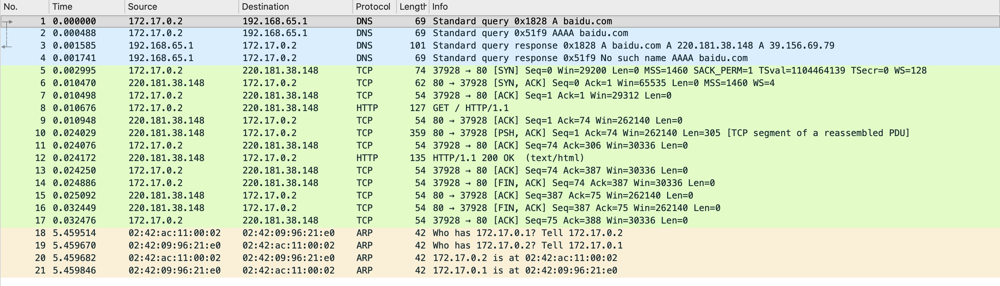

# 从一次web请求看网络

## 前期准备

1. 安装docker
2. 拉取镜像 `docker pull alpine`
3. 启动容器 `docker run -it -d --name curl alpine`
4. 进入容器 `docker exec -it curl sh`
5. 安装curl、tcpdump `apk add curl tcpdump`
6. 使用tcpdump抓包，并将结果保存在/tmp中 `tcpdump -w /tmp/baidu.cap`
7. 使用进入另一个终端 `docker exec -it curl sh`，使用 `curl baidu.com` 进行模拟请求
8. 使用 wireshark 对结果进行分析

结果如下：

## 结果分析

通过上述结果来看，即可得出以下时序

1. DNS查询
2. TCP连接建立
3. 发送HTTP请求
4. 返回HTTP信息
5. 关闭连接
6. ARP
