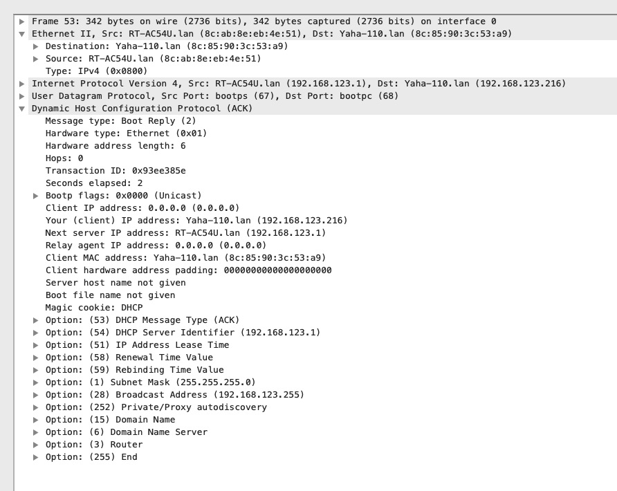

# 动态主机配置协议（DHCP）

## 1 介绍

计算机要互联通信自身肯定需要网络 ，如IP地址、子网掩码、DNS服务器地址等。而为了实现IP地址的自动设置与统一分配，DHCP就这样孕育而生了。

动态主机配置协议(DHCP)是一个**应用层协议**

DHCP的设计基于早期的Internet引导程序协议(BOOTP)，使用**UDP**协议，客户端使用端口68，服务端使用端口67。

DHCP服务器可提供三种地址分配：

- 手动分配：由网络管理员在DHCP服务器手工配置DHCP客户机的IP地址。
- 自动分配：当DHCP客户机第一次向DHCP服务器请求到IP地址后，这个地址就永久地分配给了该DHCP客户机，不可撤销。
- 动态分配：与自动分配采用相同的方法，只不过获得的IP地址是有租约期限的，一旦租约到期，地址就会被回收，不过可以通过续订租约以延长期限。

DHCP主要由两个部分组成

- 地址管理：给客户机提供IP地址的动态分配
- 配置数据交付：DHCP协议的消息格式和状态机

## 2 租用

分配给客户端的IP在一段时间内有效被称为租用期

当发送DHCP时，客户端需要向服务器发送如下信息：

- 客户机名称
- 请求租用期
- 已使用或最后使用过的地址副本
- 其他参数

当服务器向客户机提供租用期时，服务器将租用信息永久保存在**持久性存储器**中

## 3 消息格式

DHCP扩展了BOOTP，DHCP消息格式的定义也采用了扩展BOOTP的方式以保持两种协议之间的兼容性。消息格式由一个固定大小的初始部分和一个可变长度的选项部分组成。

- Op（8位）：消息类型，1表示请求，2表示响应
- HW Type（8位）：硬件地址类型，1表示以太网
- HW Len（8位）：硬件地址长度，如以太网地址长度6个字节值就为6
- Hops（8位）：保存消息传输过程中继的的次数，默认为0
- Transaction ID（32位）：事物ID。客户机所选择的一个随机数，服务器把它复制到响应消息中，用于将应答和请求匹配
- Secs（16位）：获取到IP地址或者续约过程开始到现在所消耗的时间，以秒为单位。在没有获得IP地址前该字段始终为0
- Flags（16位）：标志字段。该16位比特字段的最左边的位为 0 ，表示单播，为 1 表示广播
- Client IP address（32位）：客户机IP地址
- "Your" IP address（32位）：DHCP服务器为客户机提供的IP地址存放在此字段
- Server IP address（32位）：下一个为DHCP客户端分配IP地址等信息的DHCP服务器IP地址。仅在DHCP Offer、DHCP ACK报文中显示，其他报文中显示为0。
- Gateway (Relay) IP address（32位）：由DHCP或BOOTP中继器填写，如果消息没有经过中继器则此字段为0
- Client Hardware address（128位）：客户机硬件地址
- Server Name（64位）：可选的服务器主机名，是一个null结尾的字符串，由服务器填写
- Boot File Name（128位）：引导文件名。是一个null结尾的字符串，DHCP OFFER 报文中提供有效的文件路径，其他消息中不显示， 一般不使用
- Options（可变）：选项字段。可变字段，格式为"代码+长度+数据"，是DHCP消息和BOOTP消息的区别之处

由于DHCP是BOOTP的扩展，则有些字段在BOOTP中不存在，通过Options来进行携带

- 1：子网掩码
- 3：路由器地址
- 6：域名服务器
- 15：域名
- 50：请求的IP地址
- 51：地址租用期
- 53：DHCP消息类型
- 54：服务器标识符
- 55：参数请求列表
- 56：DHCP错误信息
- 58：租约更新时间
- 59：租约重新绑定时间
- 61：客户机标识符
- 119：域搜索列表
- 255：结束

其中消息类型选项（53）是1字节长的选项，DHCP一定会使用它，存在以下值

- DHCP DISCOVER
- DHCP OFFER
- DHCP REQUEST
- DHCP ARK
- DHCP NAK
- DHCP DECLINE
- DHCP RELEASE
- DHCP INFORM
- DHCP FORCERENEW
- DHCP LEASEQUERY
- DHCP LEASEUNASSIGNED
- DHCP LEASEUNKNOWN
- DHCP LEASEACTIVE

## 4 工作原理

1. DHCP Client以广播的方式发出DHCP Discover报文
2. 所有的DHCP Server都能够接收到DHCP Client发送的DHCP Discover报文，所有的DHCP Server都会给出响应，向DHCP Client发送一个DHCP Offer报文
3. DHCP Client只能处理其中的一个DHCP Offer报文，一般的原则是DHCP Client处理最先收到的DHCP Offer报文
4. DHCP Server收到DHCP Request报文后，判断选项字段中的IP地址是否与自己的地址相同。如果不相同，DHCP Server不做任何处理只清除相应IP地址分配记录；如果相同，DHCP Server就会向DHCP Client响应一个DHCP ACK报文，并在选项字段中增加IP地址的使用租期信息
5. DHCP Client接收到DHCP ACK报文后，检查DHCP Server分配的IP地址是否能够使用。如果可以使用，则DHCP Client成功获得IP地址并根据IP地址使用租期自动启动续延过程；如果DHCP Client发现分配的IP地址已经被使用，则DHCP Client向DHCPServer发出DHCP Decline报文，通知DHCP Server禁用这个IP地址，然后DHCP Client开始新的地址申请过程。
6. DHCP Client在成功获取IP地址后，随时可以通过发送DHCP Release报文释放自己的IP地址，DHCP Server收到DHCP Release报文后，会回收相应的IP地址并重新分配。

### 4.1 模拟一次DHCP并抓包

使用 wireshark 抓取本地网卡

1. 关闭网卡
2. 启动抓包，并启动网卡
3. 分析抓包过程

第一次客户端发起 DHCP请求时的包格式

### 4.2 linux命令

- 释放租约：dhclient -r
- 更新租约：dhclient

## 5 DHCP状态机 

DHCP协议在客户机和服务器中运行一个状态机。状态用于指出协议下一个处理的消息类型：

在简单的网络中，一个DHCP服务器可供同一个局域网中的客户机使用，但在更复杂的网络中，可通过一个或更多的DHCP中继代理来中继DHCP流量将DHCP操作扩展到跨越多个网段。

### 5.1 无状态地址自动配置

所谓的无状态地址自动配置，指的是一台主机基本不需要协助就可以决定自己的地址

### 5.2 IPv4的无状态地址自动配置

一台主机，没有任何手工配置的地址，所在网络也没有DHCP服务器，那么基于IP的通信是不可能的

## 6 DHCP与DNS交互

当一台DHCP客户机获得一个IP地址时，它接收的配置信息的重要部分是一台DNS服务器的IP地址。它允许客户机系统将DNS名称转换为IPv4和/或IPv6地址，该地址是进行传输层连接时协议实现所需要的。 

组合DNS/DHCP服务器是一个服务器程序，它可配置为提供IP地址租约以及其他信息，也可读取一个DHCPREQUEST中的客户机标识符或域名，并在使用DHCPACK进行响应之前，通过"名称到地址"的绑定更新内部DNS数据库。这样，由DHCP客户机或与相同DNS服务器交互的其他系统发起的任何后续DNS请求就能够在名称和新分配的IP地址之间转换了。