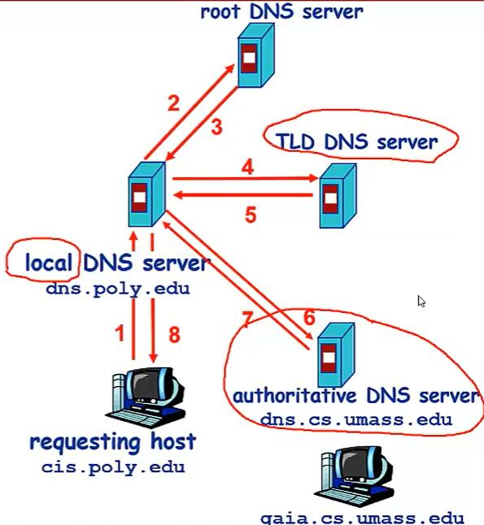
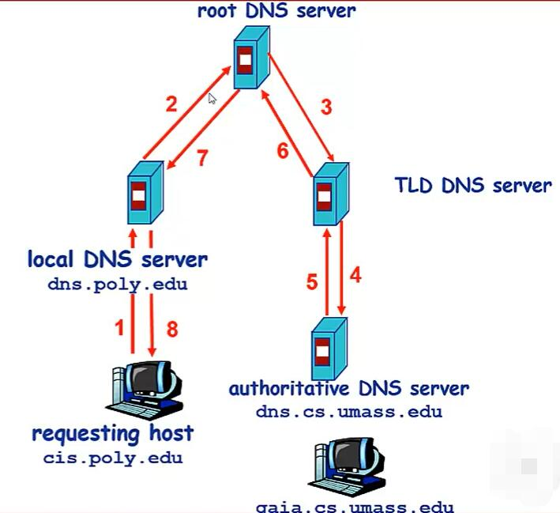
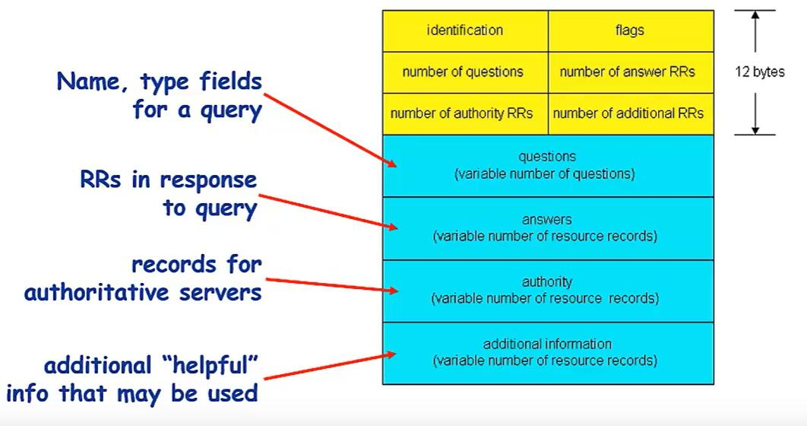

# DNS简单介绍

# 1 简介

DNS（地址解析协议），是应用层协议，是互联网的核心协议。DNS解决了互联网上主机路由的识别问题。因为互联网上主机有主机之间是通过ip来定位的。但是ip地址不利于人类记忆，域名对人有友好。所以DNS解决的就是ip地址到域名的映射的问题。

# 2 域名解析系统的结构

域名解析系统是多层命名服务器构成的分布式数据库。

由上而下分别是：

* 根域名服务器 （全球共13台）
* 顶级域名服务器
* 权威域名服务器

> 在域名解析系统中还有个本地域名服务器，但是本地域名服务器不严格属于DNS层级体系。每个ISP（互联网提供商）有一个本地域名服务器，当主机进行DNS查询时，查询被发送到本地域名服务器。本地域名服务器作为代理，将查询发给层级试域名服务器系统。

# 3 DNS核心思想

DNS的核心就是对域名和ip进行映射，并提供ing查询服务

## 3.1 迭代查询

假设以www.google.com为例，本机会通过本地域名服务器到根域名服务器进行查询，此时根域名服务器没有www.google.com的ip映射。但是它知道.com的顶级域名服务器，就会告诉本地域名服务器到.com的顶级域名服务器进行查询。本地域名服务器到顶级域名服务器进行查询，但它也没有www.google.com的ip映射，但它知道google.com的域名服务器，就会告诉本地域名服务器到google.com的权威域名服务器进行查询。最后在google.com的域名服务器查询到ip映射，并把查询结果返回给本地域名服务器。

> 下图描述的是cis.poly.edu这台机器访问qaia.cs.umass.edu时进行进行迭代查询的过程。（迭代查询）

## 3.2 递归查询

假设以www.google.com为例，本机会通过本地域名服务器到根域名服务器进行查询，此时根域名服务器没有www.google.com的ip映射。但是它知道.com的顶级域名服务器，但它并不会让本地域名服务器再到.com的顶级域名服务器进行查询，而是而是自己到.comd的顶级域名服务器进行查询。顶级域名服务器也没有www.google.com的ip映射，但它知道google.com的域名服务器，同样顶级域名服务器会自己到google.com的权威域名服务器进行查询。最后在google.com的域名服务器查询到ip映射，并把查询结果依次返回到上一层域名服务器，最终返回到本地域名服务器。

> 下图描述的是cis.poly.edu这台机器访问qaia.cs.umass.edu时进行进行迭代查询的过程。(递归查询)

# 4 缓存

DNS记录换成和更新。只要域名解析服务获得域名——IP映射，即记录这一映射，但是一段时间后缓存条目会失效，即删除这条缓存。本地域名服务器一本会缓存顶级域名服务器的映射，因此一般情况下根域名服务器不经常被访问。

# 5 DNS用的是TCP协议还是UDP协议

- DNS占用53号端口
- 使用TCP和UDP协议

**DNS在什么情况下使用这两种(TCP/UDP)协议？**

- DNS在区域传输的时候使用TCP协议，其他时候使用UDP协议。
- DNS区域传输的时候使用TCP协议：
  - 辅域名服务器会定时（一般3小时）向主域名服务器进行查询以便了解数据是否有变动。如有变动，会执行一次区域传送，进行数据同步。区域传送使用TCP而不是UDP，因为数据同步传送的数据量比一个请求应答的数据量要多得多。
  - TCP是一种可靠连接，保证了数据的准确性。
- 域名解析时使用UDP协议：
  - 客户端向DNS服务器查询域名，一般返回的内容都不超过512字节，用UDP传输即可
  - 不用经过三次握手，这样DNS服务器负载更低，响应更快。理论上说，客户端也可以指定向DNS服务器查询时用TCP，但事实上，很多DNS服务器进行配置的时候，仅支持UDP查询包。

# 6 DNS记录和消息格式

DNS记录也叫做资源记录（RR resource records）DNS记录消息的格式是（name	value	type	ttl）

* type = A:

  name : 机域名

  value : ip

* type = NS

  name : 域（edu.cn）

  value : 该权威域名解析服务器的主机域名

* type = CNAME

  name ：某一真实域名的别名

  value ：真实域名

* type = MX

  value是与name相对应的邮件服务器

dns是一个查询和回复的协议，所查询和回复的消息格式都是相同的

> 头部消息

identification:

* 16为查询编号，回复使用相同的编号

flags:

* 查询或回复
* 期望递归
* 递归可以
* 权威回答

# 7 httpNDS

HTTPDNS不走传统的DNS解析，而是自己搭建基于HTTP协议的DNS服务器集群，分布多个地点和多地运营商，当客户端需要DNS解析的时候，就通过HTTP协议进行请求这个服务器集群。到就近的地址。

而使用HTTPDNS的往往是手机应用，需要在手机端嵌入支持HTTPDNS的客户端SDK。

在客户端的SDK里动态请求服务端，获取HTTPDNS的服务器列表。缓存到本地，随着不断域名解析，SDK也会在本地缓存DNS域名解析的结果。

当应用要访问一个地址时，先看下是否有缓存（这个缓存时手机应用自己做的，不走运营商的缓存，所以如何更新，合适更新全在自己的掌控之中）如果本地没有缓存，那就请求 HTTPDNS的服务器吧。而手机客户端当然知道收集在哪个运营商，在哪个地址，由于是直接的HTTP通信，HTTPDNS也能更好的返回结果信息，更好的做到全局负载均衡。

## 7.1 DNS相对于httpDNS存在的问题

- **本地缓存**

  不是每一个请求都是去访问的权威DNS服务器，而是访问过一次，就把结果缓存到本地，当其他人来访问的时候，直接就返回了这个结果。
  
  一些运营商会把一些静态页面，缓存到本地运营商的服务器中，这样用户请求的时候，就不用跨运营商进行访问了，这样既加快了速度，也减少了运营商之间的流量计算的成本。
   再就是本地缓存，往往使得全局负载均衡失败。因为上次进行缓存的时候，缓存的地址不一定是这次访问离客户最近的地方，如果把缓存的数据返回给客户，那就绕远了。

- **域名转发问题**
  
  有一些本地DNS服务器比较黑心，收到解析请求之后，直接转发给了其他运营商去做解析，自己只是外包出去了。比如你是移动用户，你发起对baidu.com 的解析请求，而移动的本地DNS服务器将解析转给联通的DNS服务器，最终GSLB误认为你是联通的，返回一个相对于联通用户的更优解。结果每次客户端访问其实都是跨运营商的，速度就会慢很多。

- **出口NAT**

  在 IPV4 地址不够用的大环境下，其实有十分多的NAT，也就是网络地址转换。使得从这个网关出去的包都换成了一个新的IP地址。一旦做了地址转换，可能GSLB（全局负载均衡）就不知道你的运营商，源IP了。

- **域名更新**
 
  受TTL限制，解析变更在全网的生效时间较长。我们这里一个机房挂了，将这个机房的A记录摘掉。但是往往过了一天还能发现有流量过来（这就和TTL没关系了，还是本地DNS层层缓存惹的祸）

- **解析延迟问题**
 
  一个解析需要递归本地DNS 可能多次，再去迭代。比较慢。

