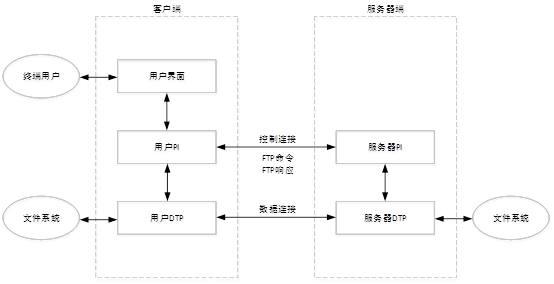

# FTP

## 1 功能

允许用户能够从远程计算机上传、下载文件，同时提供交互访问（如文件复制、创建、删除等）

## 2 目标

- 促进文件的共享（计算机程序或数据）
- 鼓励间接或者隐式的使用远程计算机
- 向用户屏蔽不同主机中各种文件存储系统（File system）的细节
- 可靠和高效的传输数据

## 3 模型

- 采用C/S模型
- 端口 21

从上图可以看出，FTP服务器和客户包含两个组成部分

- 协议解释器（PI）：主要是C/S之间控制连接，命令交互
- 数据传输进程（DTP）：控制和管理数据连接，DTP受控于PI，在需要传输数据时，PI调用DTP建立数据连接

## 4 工作方式

- PORT（主动）：客户端向服务器的FTP端口（默认是21）发送连接请求，服务器接受连接，建立一条命令链路。当需要传送数据时，客户端在命令链路上用PORT命令告诉服务器：“我打开了XXXX端口，你过来连接我”。于是服务器从20端口向客户端的XXXX端口发送连接请求，建立一条数据链路来传送数据。
- PASV（被动）：客户端向服务器的FTP端口（默认是21）发送连接请求，服务器接受连接，建立一条命令链路。当需要传送数据时，服务器在命令链路上用PASV命令告诉客户端：“我打开了XXXX端口，你过来连接我”。于是客户端向服务器的XXXX端口发送连接请求，建立一条数据链路来传送数据。

## 5 工作原理

FTP 使用 TCP 进行连接，它需要两个连接来传送一个文件：

1. 控制连接：服务器打开端口号 21 等待客户端的连接，客户端主动建立连接后，使用这个连接将客户端的命令传送给服务器，并传回服务器的应答
2. 数据连接：用来传送一个文件数据
3. 根据数据连接是否是服务器端主动建立

