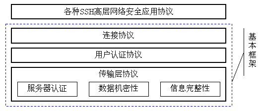
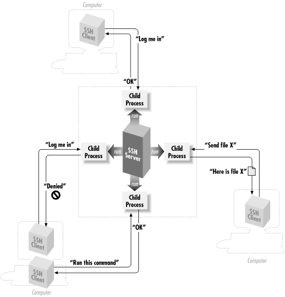
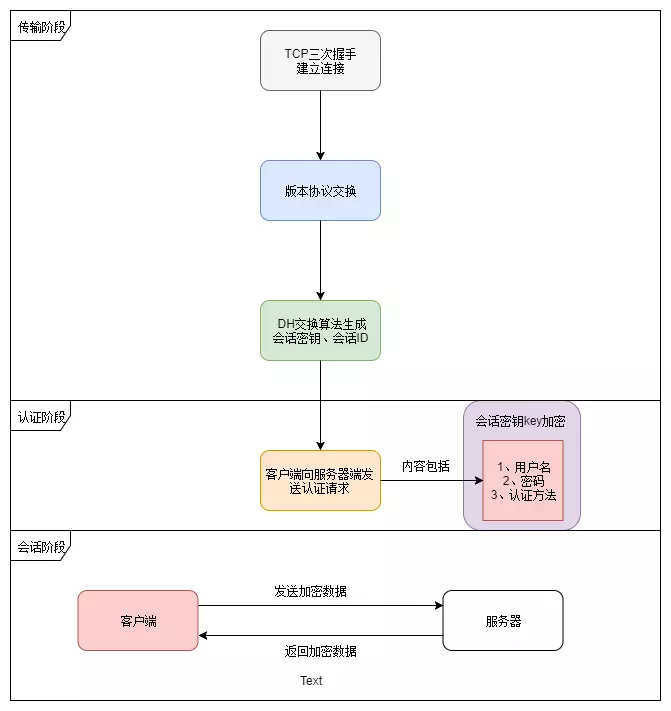
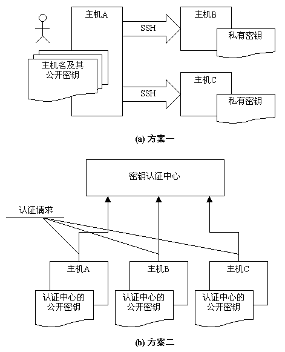
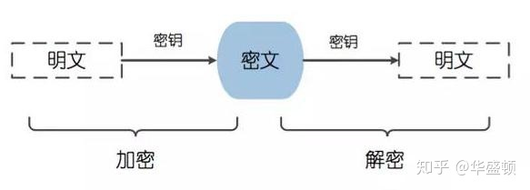
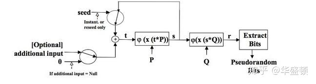
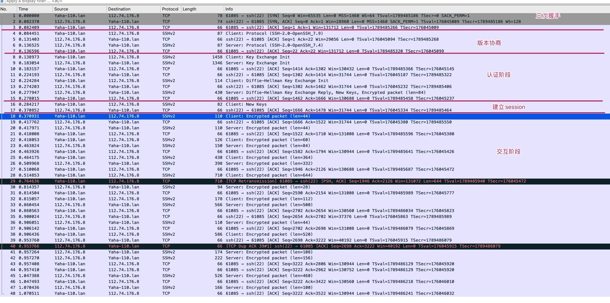
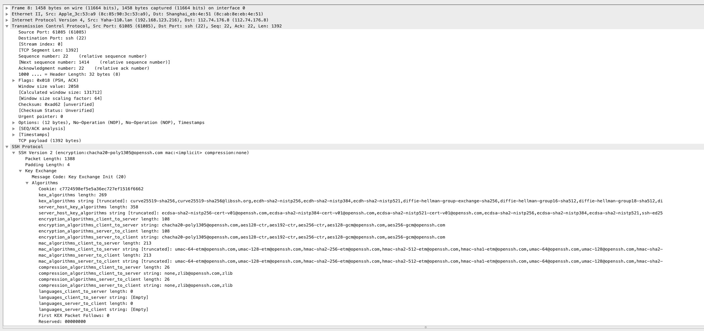

# SSH协议

## 1 概念

SSH是英文Secure Shell的简写形式。通过使用SSH，你可以把所有传输的数据进行加密，这样"中间人"这种攻击方式就不可能实现了，而且也能够防止DNS欺骗和IP欺骗。使用SSH，还有一个额外的好处就是传输的数据是经过压缩的，所以可以加快传输的速度。SSH有很多功能，它既可以代替Telnet，又可以为FTP、Pop、甚至为PPP提供一个安全的"通道"。

## 2 工作流程

SSH协议框架中最主要的部分是三个协议：

- 传输层协议（The Transport Layer Protocol）提供服务器认证，数据机密性，信息完整性 等的支持；
- 用户认证协议（The User Authentication Protocol） 则为服务器提供客户端的身份鉴别；
-  连接协议（The Connection Protocol） 将加密的信息隧道复用成若干个逻辑通道，提供给更高层的应用协议使用； 各种高层应用协议可以相对地独立于SSH基本体系之外，并依靠这个基本框架，通过连接协议使用SSH的安全机制。

在整个通讯过程中，为实现 SSH的安全连接，服务器端与客户端要经历如下五个阶段：

- 版本号协商阶段：SSH目前包括 SSH1和SSH2两个版本， 双方通过版本协商确定使用的版本
- 密钥和算法协商阶段：SSH支持多种加密算法， 双方根据本端和对端支持的算法，协商出最终使用的算法
- 认证阶段：SSH客户端向服务器端发起认证请求， 服务器端对客户端进行认证
- 会话请求阶段：认证通过后，客户端向服务器端发送会话请求
- 交互会话阶段：会话请求通过后，服务器端和客户端进行信息的交互

### 2.1 三次握手过程

### 2.2 主机密钥机制

对于SSH这样以提供安全通讯为目标的协议，其中必不可少的就是一套完备的密钥机制。由于SSH协议是面向互联网网络中主机之间的互访与信息交换，所以主机密钥成为基本的密钥机制。也就是说，SSH协议要求每一个使用本协议的主机都必须至少有一个自己的主机密钥对，服务方通过对客户方主机密钥的认证之后，才能允许其连接请求。一个主机可以使用多个密钥，针对不同的密钥算法而拥有不同的密钥，但是至少有一种是必备的，即通过 DSS算法产生的密钥。关于DSS算法，请参考[FIPS-186]。

SSH协议关于主机密钥认证的管理方案有两种：

每一个主机都必须有自己的主机密钥，密钥可以有多对，每一对主机密钥对包括公开密钥和私有密钥。在实际应用过程中怎样使用这些密钥，并依赖它们来实现安全特性呢？如上图所示，SSH协议框架中提出了两种方案。

在第一种方案中，主机将自己的公用密钥分发给相关的客户机，客户机在访问主机时则使用该主机的公开密钥来加密数据，主机则使用自己的私有密钥来解密数据，从而实现主机密钥认证，确定客户机的可靠身份。在图2（a）中可以看到，用户从主机A上发起操作，去访问，主机B和主机C，此时，A成为客户机，它必须事先配置主机B和主机C的公开密钥，在访问的时候根据主机名来查找相应的公开密钥。对于被访问主机（也就是服务器端）来说则只要保证安全地存储自己的私有密钥就可以了。 

在第二种方案中，存在一个密钥认证中心，所有系统中提供服务的主机都将自己的公开密钥提交给认证中心，而任何作为客户机的主机则只要保存一份认证中心的公开 密钥就可以了。在这种模式下，客户机在访问服务器主机之前，还必须向密钥认证中心请求认证，认证之后才能够正确地连接到目的主机上。

很 显然，第一种方式比较容易实现，但是客户机关于密钥的维护却是个麻烦事，因为每次变更都必须在客户机上有所体现；第二种方式比较完美地解决管理维护问题， 然而这样的模式对认证中心的要求很高，在互联网络上要实现这样的集中认证，单单是权威机构的确定就是个大麻烦，有谁能够什么都能说了算呢？但是从长远的发 展来看，在企业应用和商业应用领域，采用中心认证的方案是必要的。

另外，SSH协议框架中还允许对主机密钥的一个折中处理，那就是首次访问免认证。首次访问免认证是指，在某客户机第一次访问主机时，主机不检查主机密钥，而向该客户都发放一个公开密钥的拷贝，这样在以后的访问中则必须使用该密钥，否则会被认为非法而拒绝其访问。

### 2.3 SSH加密算法

SSH为了确保信息的安全传输，从连接发起到完成各阶段的各个点SSH协议采用了许多不同类型的数据加密技术，包括可逆的对称加密，非对称加密以及不可逆的哈希散列。

#### 2.3.1 对称加密

对称加密是一种加密类型，在加密和解密时候使用同一个密钥。所以，在对称加密中，任何人都可以利用该密钥加密消息和解密任何使用它加密的消息。这种加密方法通常也称为"共享密钥"加密或"密钥"加密。通常只有一个密钥用于所有加解密操作，或者使用一对密钥，但是这对密钥可以互相简单推算出彼此。

SSH数据传输时候基本上所有过程都是使用对称密钥来加密。只有在刚开始创建连接阶段和身份认证握手阶段才使用非对称加密。

客户端和服务器都通过协商一致的算法生成密钥，并互相通过可信通道交换密钥，这个过程叫密钥交换。通过密钥交换服务器和客户端可共享某些公共数据结合自己隐秘数据通过算法各自获得相同的共享密钥。后面第二部分虫虫会对此过程进行详细解释。此过程创建的对称加密密钥是基于会话的，然后通过该会话在服务器和客户端之间发送的加密数据。会话一旦创建，此后所有数据数据都通过共享密钥加密。

在对称加密过程中最重要的是加密算法。SSH中支持各种不同的加密算法，主要有AES，Blowfish，3DES，CAST128和Arcfour等等。服务器和客户端可以根据优先顺序协商其支持的密码列表。服务器上可用的客户端列表中的第一个选项就是密码算法。

#### 2.3.2 非对称加密

非对称加密与对称加密的不同之处在于，为了在单个方向上发送数据，需要两个相关的一组密钥。其中一个密钥称为私钥，而另一个称为公钥。

公钥可以公开共享。私钥与之配，无法通过公钥计算出公钥。公钥和私钥之间从数学的特性保证公钥加密的信息只能由私钥解密，私钥加密的信息也不能用公钥解密。

非对称加密中是用最广泛RSA算法就用到了利用大素数方便生成大整数（2048），但是该大素数则几乎无法分解的特性。最近热门的阿蒂亚老教授宣布证明《黎曼猜想》，就是用关于大素数分布的规律，如果该证明有效，能发现大素数的分布规律，则可能会影响大素数分解，读广泛使用的RSA算法可能产生影响。

SSH在建立对称加密（用于加密会话）的初始密钥交换过程中，使用了非对称加密。在该阶段，双方都生成临时密钥对并互相交换公钥，以便产生将用于对称加密的共享密钥。

SSH还通过使用非对称加密的来进行SSH密钥的身份验证：

- 客户端创建密钥对，然后将公钥配置到远程服务器上，具体为用户帐户目录的~/.ssh目录下名为authorized_keys文件,每一行对应一个公钥。
- 收到用户请求后，服务器端利用authorized_keys中公钥比对证书指纹，找到用户公钥加密一个消息，并对消息生成哈希串附加到消息后返回给客户端。如果客户端能利用自己私钥解密消息，并用自己手中服务器端的公钥加密验证串给服务器，服务用自己私钥解密消息完成认证，这样证书交换和身份认证过程完成（密钥交换过程中各自独立计算出了对称加密的共享密钥），开始进行加密数据传输。

#### 2.3.3 哈希散列

SSH协议中还用到了加密散列。哈希散列算法是一种不可逆算法，除非你知道原始值生成散列对比，否则你永远无法通过散列算出原始值（但是可以通过哈希碰撞，就是利用可能字串或者构造彩虹表大量生成哈希进行对比，目前MD5和SSA1已经不再绝对安全）。散列算法常用于创建信息 "签名"或生成一组信息摘要，用来保证信息传输过程中没有被人认为篡改。因为对数据的任何修改都会导致其哈希完全不一致。

## 3 过程解释

### 3.1 版本号协商阶段

1. 服务器打开端口 22，等待客户端连接。
2. 客户端向服务器端发起 TCP初始连接请求，TCP连接建立后，服务器向客户端发送第一个报文，包括版本标志字符串，格式为“SSH－<主协议版本号>.<次协议版本号>－<软件版本号>”，协议版本号由主版本号和次版本号组成，软件版本号主要是为调试使用。
3. 客户端收到报文后，解析该数据包，如果服务器端的协议版本号比自己的低，且客户端能支持服务器端的低版本，就使用服务器端的低版本协议号，否则使用自己的协议版本号。
4. 客户端回应服务器一个报文，包含了客户端决定使用的协议版本号。服务器比较客户端发来的版本号，决定是否能同客户端一起工作。
5. 如果协商成功，则进入密钥和算法协商阶段，否则服务器端断开 TCP连接。

### 3.2 密钥和算法协商阶段

1. 服务器端和客户端分别发送算法协商报文给对端，报文中包含自己支持的公钥算法列表、加密算法列表、MAC（Message Authentication Code，消息验证码）算法列表、压缩算法列表等;
2. 服务器端和客户端根据对端和本端支持的算法列表得出最终使用的算法。
3. 服务器端和客户端利用 DH交换（Diffie-Hellman Exchange）算法、主机密钥对等参数，生成会话密钥和会话 ID。

### 3.3 认证阶段

1. 客户端向服务器端发送认证请求，认证请求中包含用户名、认证方法、与该认证方法相关的内容（如：password认证时，内容为密码）。
2. 服务器端对客户端进行认证，如果认证失败，则向客户端发送认证失败消息，其中包含可以再次认证的方法列表。
3. 客户端从认证方法列表中选取一种认证方法再次进行认证。
4. 该过程反复进行， 直到认证成功或者认证次数达到上限， 服务器关闭连接为止。

### 3.4 SSH提供两种认证方式

- password认证：客户端向服务器发出 password认证请求，将用户名和密码加密后发送给服务器；服务器将该信息解密后得到用户名和密码的明文，与设备上保存的用户名和密码进行比较，并返回认证成功或失败的消息。
- publickey认证：采用数字签名的方法来认证客户端。目前，设备上可以利用RSA和 DSA两种公共密钥算法实现数字签名。客户端发送包含用户名、公共密钥和公共密钥算法的 publickey 认证请求给服务器端。服务器对公钥进行合法性检查，如果不合法，则直接发送失败消息；否则，服务器利用数字签名对客户端进行认证，并返回认证成功或失败的消息

## 4 实验过程

1. 使用抓包工具监听服务端IP：host xxx.xx.xx.xx
2. 使用ssh进行连接

### 4.1 整体流程

### 4.2 Key Exchange Init

- kex_algorithms：密钥交换算法，里边即包含我们使用的D-H算法，用于生成会话密钥
- server_host_key_algorithms：服务器主机密钥算法，可以采用 ssh-rsa,ssh-dss,ecdsa-sha2-nistp256,有公钥和私钥的说法，公钥即我们上面讲到的pub key,对于公钥私钥的概念，可以参见understanding public key private key concepts
- encryption_algorithms_client_to_server：对称加密算法，常用的有aes128-cbc,3des-cbc
- mac_algorithms_client_to_server：MAC算法，主要用于保证数据完整性
- compression_algorithms_client_to_server：压缩算法

## 5 问题

### 5.1 SSH的版本和区别。

SSH(Secure SHell)到目前为止有两个不兼容的版本——SSH1和SSH2。SSH1又分为1.3和1.5两个版本。SSH1采用DES、3DES、 Blowfish和RC4等对称加密算法保护数据安全传输，而对称加密算法的密钥是通过非对称加密算法（RSA）来完成交换的。SSH1使用循环冗余校验码（CRC）来保证数据的完整性，但是后来发现这种方法有缺陷。

### 5.2 什么是HMAC？

HMAC(Hash Message Authentication Code) ，散列消息鉴别码，基于密钥的Hash算法的认证协议。消息鉴别码实现鉴别的原理是，用公开函数和密钥产生一个固定长度的值作为认证标识，用这个标识鉴别消息的完整性。使用一个密钥生成一个固定大小的小数据块，即MAC，并将其加入到消息中，然后传输。接收方利用与发送方共享的密钥进行鉴别认证等。

### 5.3 简单描述下SSH运行的过程？

简要过程如下：

1. Client端向Server端发起SSH连接请求。
2. Server端向Client端发起版本协商。
3. 协商结束后Server端发送Host Key公钥 Server Key公钥，随机数等信息。到这里所有通信是不加密的。
4. Client端返回确认信息，同时附带用公钥加密过的一个随机数，用于双方计算Session Key。
5. 进入认证阶段。从此以后所有通信均加密。
6. 认证成功后，进入交互阶段。