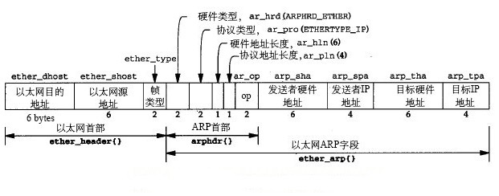
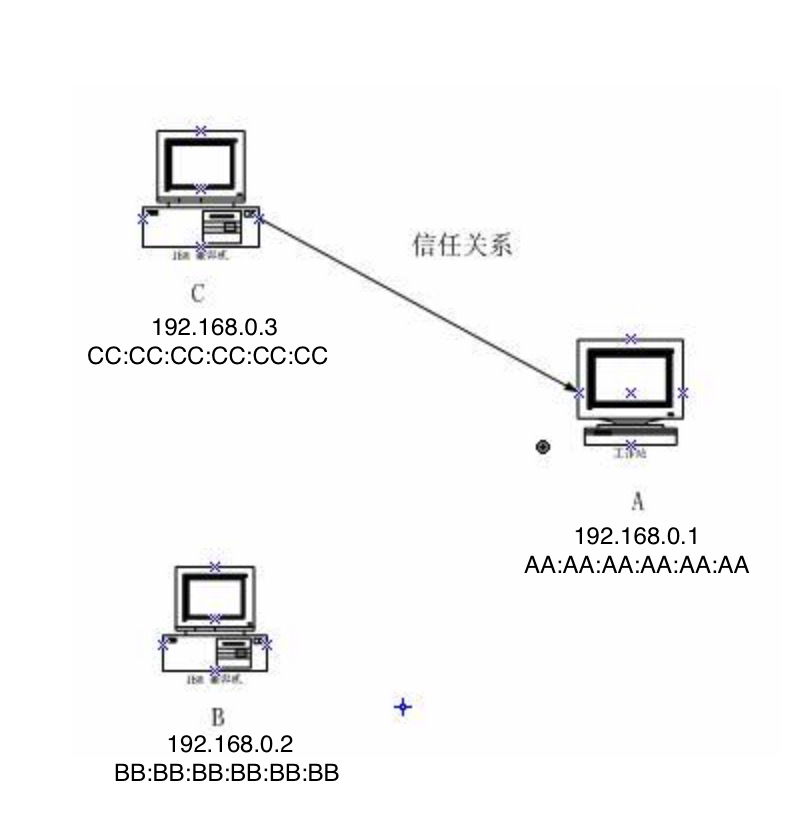
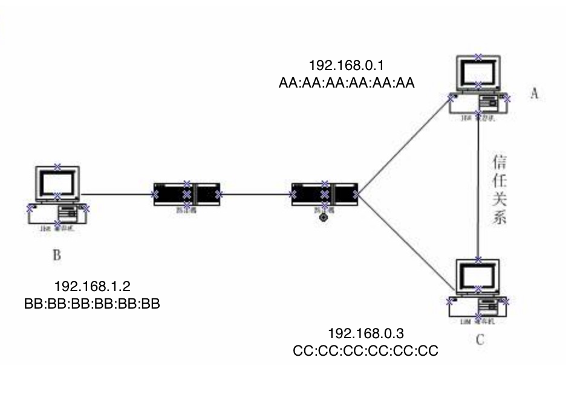

# 地址解析协议

地址解析是发现两个地址之间的映射关系的过程

# 1 ARP

ARP是一个通用的协议，ARP提供从网络层地址到相关硬件地址的动态映射

​	1. 在网络通信中，主机和主机通信的数据包需要依据OSI模型从上到下进行数据封装，当数据封装完整后，再向外发出。所以在局域网的通信中，不仅需要源目IP地址的封装，也需要源目MAC的封装。
​	2.**ARP（Address Resolution Protocol）即地址解析协议， 用于实现从 IP 地址到 MAC 地址的映射，即询问目标IP对应的MAC地址**。
​	3. 一般情况下，上层应用程序更多关心IP地址而不关心MAC地址，所以需要通过ARP协议来获知目的主机的MAC地址，完成数据封装。

## 1.1 ARP和直接交付

- 直接交付发生在 一个IP数据报被发送到一个IP地址，而该地址与发送方具有相同IP前缀的情况下

- ARP用于运行IPv4的多接入链路层网络，每个主机都有自已首选的硬件地址。点到点链路(例如PPP)不使用ARP。当这些链路被建立后(通常是由用户或系统来发起创建)，在链路两端通知正在使用的地址。由于不涉及硬件地址，因此不需要地址解析或 ARP

**ARP分步解析：**

1. 主机A在自己的ARP缓存表中寻找是否有目标IP地址。如果找到目标MAC地址，直接把目标MAC地址写入帧里面发送。

2. 如果没有，在一个**共享的链路层网段**上，ARP向**所有主机**`(目标MAC地址是“FF.FF.FF.FF.FF.FF”)`发送一个称为ARP请求的以太网帧。 这被称为链路层广播。

3. 通过ARP，同一广播域中的所有系统可接收ARP请求。网络上其他主机并不响应ARP询问，只有主机B接收到这个帧时，才向主机A以**单播方式**回应。同时主机

4. ARP应答被原始请求的发送方接收，现在可发送引起这次ARP请求/应答交换过程的数据报

5. 发送方可将数据报封装在以太网帧中直接发送到目的主机，并使用由ARP交换学到的以太网地址作为目的地址。由于这个以太网地址仅指向正确的目的主机，所以其他主机或路由器不会接收到这个数据报。

当主机A和主机B**不在同一网段**时，主机A就会先向网关发出ARP请求，ARP请求报文中的目标IP地址为网关的IP地址。当主机A从收到的响应报文中获得网关的MAC地址后，将报文封装并发给网关。如果网关没有主机B的ARP表项，网关会广播ARP请求，目标IP地址为主机B的IP地址，当网关从收到的响应报文中获得主机B的MAC地址后，就可以将报文发给主机B；如果网关已经有主机B的ARP表项，网关直接把报文发给主机B。

## 1.2 ARP缓存

### 1.2.1 ARP缓存表

ARP高效运行是维护每个主机和路由器上的ARP缓存，该缓存使用地址解析为每个接口维护从网络层地址到硬件地址的最新映射

```
~ arp
Address                  HWtype  HWaddress           Flags Mask            Iface
gateway                  ether   ee:ff:ff:ff:ff:ff   C                     eth0

~ arp -a
gateway (172.16.63.253) at ee:ff:ff:ff:ff:ff [ether] on eth0
```

每一个映射包含5个元素：

- 主机名
- 硬件地址类型
- 硬件地址
- 标志
    + C：ARP协议动态学习
    + M：手动输入
    + P：发布，主机对输入的ARP请求返回一个ARP应答
- 本地网络接口

### 1.2.2 ARP缓存过期问题

两台相同IP地址 的主机A、B和一台IP不同的嵌入式主机C通过局域网络进行通信，A和B不同时连接到交换机/路由器。发现其中任意一台主机先和嵌入式计算机C通讯，然后断开这台主机的物理连接，连上另一台主机到网络，这时候另一台主机和嵌入式主机C之间就会出现嵌入式主机C无法发送数据到后连主机的情况，但是该主机可以发送数据给嵌入式主机C。

这是由于ARP缓存表的问题。由于两台主机A和B的IP相同，但是两台主机的网卡的MAC地址是不一样的，所以主机A发送数据给主机C的时候，嵌入式主机C内部的ARP缓存表中的映射是将主机A的MAC地址和A/B主机的IP地址映射在一起的，这时候再将主机A替换成主机B的话，如果主机B中已经有主机C的ARP映射条目（主机B之前也和嵌入式主机C单独通讯过，所以主机B有嵌入式主机C的ARP缓存。如果主机B没有嵌入式主机C的ARP映射条目，会发送ARP帧进行地址解析，这个过程中嵌入式主机C也会更新ARP地址映射，所以不会出现无法通讯的情况），主机B可以向嵌入式主机C发送数据，但是嵌入式主机C已经有了A/B主机IP地址的ARP映射条目，对应的是主机A的MAC地址，且在一定时间内就不会在发送ARP帧进行地址解析，这时候嵌入式主机C向主机B发送数据就会出现MAC地址不对应，网络数据在数据链路层可能就会被网卡过滤掉。

解决办法就是重启嵌入式主机C的网卡，这样清除ARP缓存表之后就可以重新建立ARP缓存表，恢复正常通信了。

## 1.3 ARP帧格式



# 2 代理ARP

### 2.1 概念

proxy ARP就是通过使用一个主机(通常为router),来作为指定的设备对另一设备的ARP请求作出应答。

代理ARP是ARP协议的一个变种。对于没有配置缺省网关的计算机要和其他网络中的计算机实现通信，网关收到源计算机的 ARP 请求会使用自己的 MAC 地址与目标计算机的 IP地址对源计算机进行应答。代理ARP就是将一个主机作为对另一个主机ARP进行应答。它能使得在不影响路由表的情况下添加一个新的Router，使得子网对该主机来说变得更透明化。同时也会带来巨大的风险，除了ARP欺骗，和某个网段内的ARP增加，最重要的就是无法对网络拓扑进行网络概括。代理ARP的使用一般是使用在没有配置默认网关和路由策略的网络上的。

### 2.2 应用：

- 有利的就是我们在防火墙实现中常说的透明模式的实现。

- 有害的就是通过它可以达到在交换环境中进行嗅探的目的。

### 2.3 原理

```
    eth0               eth0 eth1               eth0
    A------------------Router R------------------B
192.168.0.11/24      192.168.0.0/24 eth0      192.168.1.22/24
                     192.168.1.0/24 eth1  
                    
```

- 在主机A上请求主机B，主机A不知道主机B的MAC地址是多少。
- 首先要发送ARP查询报文，路由器R接收到主机A发出的ARP查询报文，并代替主机B作出应答。
- 应答ARP报文中填入的就是路由器R的MAC地址。
- 主机A认为路由器R的地址是192.168.1.22。以后所有发往192.168.1.22的报文都发到路由器R。
- 路由器R再根据已配置好的路由表将报文转发给主机B。

**优点：** 主机A上不需要设置任何默认网关或路由策略，不管路由器R的IP地址怎么变化，主机A都能通过路由器B到达主机B，也就是实现了所谓的透明代理。

**缺点：** 若主机A上设置有默认网关或路由策略时，当主机A向192.168.1.22发送报文，首先要查找路由表，而主机A所在的网段是192.168.0.0/24，主机B所在网段是192.168.1.0/24，主机A只能通过默认网关将报文发送出去，这样代理ARP也就失去了作用。


# 3 ARP攻击

### 3.1 同一网段的ARP欺骗



1. 使主机C宕掉，暂时停止工作。
2. 这段时间里，入侵者B把自己的ip改成192.0.0.3
3. 他用工具发一个源ip地址为192.168.0.3源MAC地址为BB:BB:BB:BB:BB:BB的包给主机A，要求主机A更新自己的arp转换表。
4. 主机更新了arp表中关于主机C的ip-->mac对应关系。
5. 防火墙失效了，入侵的ip变成合法的mac地址，可以telnet 了。

### 3.2  不同网段的ARP欺骗

##### ICMP重定向

ICMP重定向报文是ICMP控制报文中的一种。在特定的情况下，当路由器检测到一台机器使用非优化路由的时候，它会向该主机发送一个ICMP重定向报文，请求主机改变路由。路由器也会把初始数据报向它的目的地转发。



1. 为了使自己发出的非法ip包能在网络上能够存活长久一点，开始修改ip包的生存时间ttl为下面的过程中可能带来的问题做准备。把ttl改成255. (ttl定义一个ip包如果在网络上到不了主机后，在网络上能存活的时间，改长一点在本例中有利于做充足的广播)
2. 下载一个可以自由制作各种包的工具（例如hping2）
3. 然后和上面一样，寻找主机C的漏洞按照这个漏洞当掉主机C。
4. 在该网络的主机找不到原来的192.0.0.3后，将更新自己的ARP对应表。于是他发送一个原ip地址为192.168.0.3硬件地址为BB:BB:BB:BB:BB:BB的ARP响应包。
5. 好了，现在每台主机都知道了，一个新的MAC地址对应192.0.0.3,一个ARP欺骗完成了，但是，每台主机都只会在局域网中找这个地址而根本就不会把发送给192.0.0.3的ip包丢给路由。于是他还得构造一个ICMP的重定向广播。
6. 自己定制一个ICMP重定向包告诉网络中的主机："到192.0.0.3的路由最短路径不是局域网，而是路由，请主机重定向你们的路由路径，把所有到192.0.0.3的ip包丢给路由。"
7. 主机A接受这个合理的ICMP重定向，于是修改自己的路由路径，把对192.0.0.3的通讯都丢给路由器。
8. 入侵者终于可以在路由外收到来自路由内的主机的ip包了，他可以开始telnet到主机的23口。

其实上面的想法只是一种理想话的情况，主机许可接收的ICMP重定向包其实有很多的限制条件，这些条件使ICMP重定向变的非常困难。

**TCP/IP协议实现中关于主机接收ICMP重定向报文主要有下面几条限制：**

1. 新路由必须是直达的
2. 重定向包必须来自去往目标的当前路由
3. 重定向包不能通知主机用自己做路由
4. 被改变的路由必须是一条间接路由

由于有这些限制，所以ICMP欺骗实际上很难实现。但是我们也可以主动的根据上面的思维寻找一些其他的方法。更为重要的是我们知道了这些欺骗方法的危害性，我们就可以采取相应的防御办法。