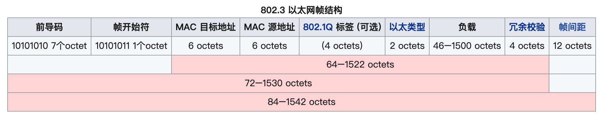
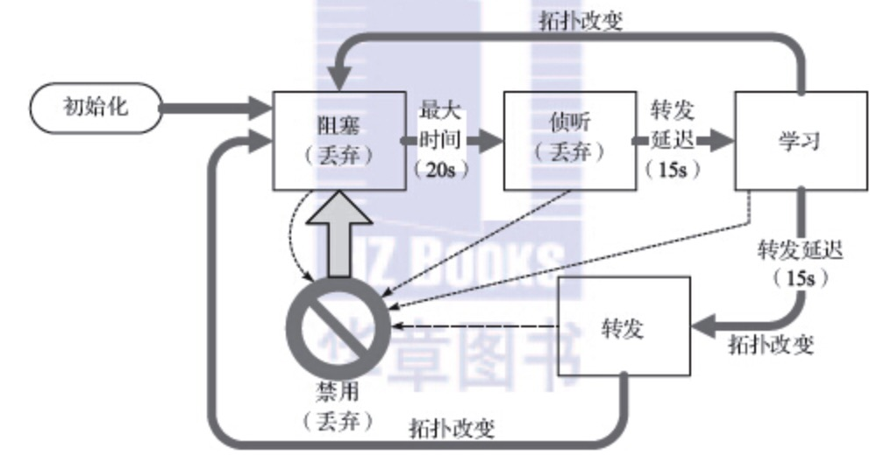
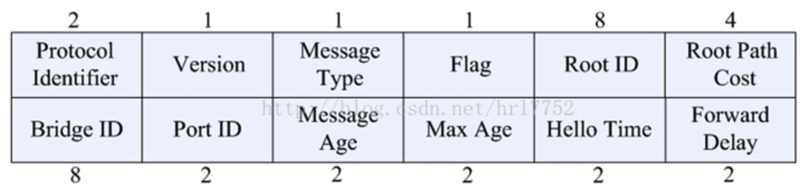

# 以太帧

所有的以太帧（802.3）帧都基于一个共同的格式。开始是一个前导字段，确定到达时间，并确定编码位（时钟恢复）。前导是一个公认模式（典型值为0xAA），帧起始分隔符（SFD，固定值0xAB）

## 1 帧格式

- 前导码和帧开始符（一个帧以7个字节的前导码和1个字节的帧开始符作为帧的开始。）
- 报头（报头包含源地址和目标地址的MAC地址）
- 帧校验码（帧校验码是一个32位循环冗余校验码）
- 帧间距（当一个帧发送出去之后，发送方在下次发送帧之前，需要再发送至少12个octet的空闲线路状态码）

## 2 循环冗余校验

是一种根据网络数据包或计算机文件等数据产生简短固定位数校验码的一种散列函数，主要用来检测或校验数据传输或者保存后可能出现的错误

CRC为校验和的一种，是两个字节数据流采用二进制除法（没有进位，使用XOR来代替减法）相除所得到的余数。其中被除数是需要计算校验和的信息数据流的二进制表示；除数是一个长度为(n+1)的预定义（短）的二进制数，通常用多项式的系数来表示。在做除法之前，要在信息数据之后先加上n个0.

CRC是基于有限域GF(2)（即除以2的同余）的多项式环。简单的来说，就是所有系数都为0或1（又叫做二进制）的多项式系数的集合，并且集合对于所有的代数操作都是封闭的。

[【维基百科】循环冗余校验](https://zh.wikipedia.org/wiki/%E5%BE%AA%E7%92%B0%E5%86%97%E9%A4%98%E6%A0%A1%E9%A9%97)

## 3 帧大小

- max：1518字节（包括4字节CRC和14字节头部）
- min：64字节

## 4 双工

## 5 生成树协议

网桥可能单独或与其他网桥共同运行，当两个以上网桥使用时，由于存在级联的可能性，因此可能形成很多组的循环帧。

STP通过在每个网桥禁用某些端口来工作，这样可以避免拓扑环路（两个网桥之间不允许出现重复路径）

[【维基百科】生成树协议](https://zh.wikipedia.org/wiki/%E7%94%9F%E6%88%90%E6%A0%91%E5%8D%8F%E8%AE%AE)

## 6 端口

### 6.1 状态

- 阻塞
- 侦听
- 学习
- 转发
- 禁用

### 6.2 角色

- 根端口
- 指定端口
- 备用端口
- 备份端口

## 7 BPDU结构

STP（Spanning Tree Protocol，生成树协议）是根据IEEE 802.1D 标准建立的，用于在局域网中消除数据链路层物理环路的协议。运行该协议的设备通过彼此交互信息发现网络中的环路，并有选择的对某些端口进行阻塞，最终将环路网络结构修剪成无环路的树型网络结构，从而防止报文在环路网络中不断增生和无限循环，避免设备由于重复接收相同的报文所造成的报文处理能力下降的问题发生。

STP采用的协议报文是BPDU（Bridge Protocol Data Unit，桥协议数据单元），也称为配置消息，BPDU中包含了足够的信息来保证设备完成生成树的计算过程。STP即是通过在设备之间传递BPDU来确定网络的拓扑结构。

要实现生成树的功能，交换机之间传递BPDU报文实现信息交互，所有支持STP协议的交换机都会接收并处理收到的报文。该报文在数据区里携带了用于生成树计算的所有有用信息。

- Protocol identifier： 协议标识
- Version： 协议版本
- Message type： BPDU类型
- Flag： 标志位
- Root ID： 根桥ID，由两字节的优先级和6字节MAC地址构成
- Root path cost： 根路径开销
- Bridge ID： 桥ID，表示发送BPDU的桥的ID，由2字节优先级和6字节MAC地址构成
- Port ID： 端口ID，标识发出BPDU的端口
- Message age： BPDU生存时间
- Maximum age： 当前BPDU的老化时间，即端口保存BPDU的最长时间
- Hello time： 根桥发送BPDU的周期
- Forward delay： 表示在拓扑改变后，交换机在发送数据包前维持在监听和学习状态的时间
- 桥ID（Bridge Identifier）：桥ID是桥的优先级和其MAC地址的综合数值，其中桥优先级是一个可以设定的参数。桥ID越低，则桥的优先级越高，这样可以增加其成为根桥的可能性。
- 根桥（Root Bridge）：具有最小桥ID的交换机是根桥。请将环路中所有交换机当中最好的一台设置为根桥交换机，以保证能够提供最好的网络性能和可靠性。
- 指定桥（Designated Bridge）：在每个网段中，到根桥的路径开销最低的桥将成为指定桥，数据包将通过它转发到该网段。当所有的交换机具有相同的根路径开销时，具有最低的桥ID的交换机会被选为指定桥。
- 根路径开销（Root Path Cost）：一台交换机的根路径开销是根端口的路径开销与数据包经过的所有交换机的根路径开销之和。根桥的根路径开销是零。
- 桥优先级（Bridge Priority）：是一个用户可以设定的参数，数值范围从0到32768。设定的值越小，优先级越高。交换机的桥优先级越高，才越有可能成为根桥。
- 根端口（Root Port）：非根桥的交换机上离根桥最近的端口，负责与根桥进行通信，这个端口到根桥的路径开销最低。当多个端口具有相同的到根桥的路径开销时，具有最高端口优先级的端口会成为根端口。
- 指定端口（Designated Port）：指定桥上向本交换机转发数据的端口。
- 端口优先级（Port Priority）：数值范围从0到255，值越小，端口的优先级就越高。端口的优先级越高，才越有可能成为根端口。
- 路径开销（Path Cost）：STP协议用于选择链路的参考值。STP协议通过计算路径开销，选择较为“强壮”的链路，阻塞多余的链路，将网络修剪成无环路的树型网络结构。

## 8 点到点协议

PPP表示点到点协议，是一种在串行链路上传输IP数据报的方法。

PPP是一个协议的集合，支持建立链接的基本方法：链路控制协议，以及一系列的NCP协议，在LCP建立了基本链接之后，用于为各种协议（IPv4、IPv6和非IP协议）建立网络层链路

**以下用到了再补充，暂时用不上，只是了解大概**

### 8.1 链路控制协议

### 8.2 LCP操作
