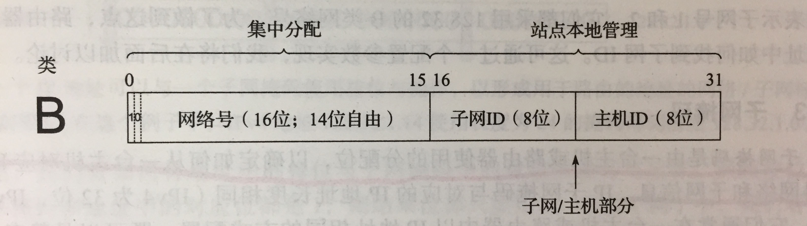

# Internet地址结构

# 1 IP地址的表示

IPv4地址是使用点分四组或点分十进制表示法，由32位非负数组成,一共有2^32种可能
IPv6地址是由块或者字段的四个十六进制数，是由128位来表示，一共有2^128种可能

| 点分四组表示 | 二进制表示 |
|:--|:--|
| 0.0.0.0 | 00000000 00000000 00000000 00000000 |
| ::1 | 0000000000000000 ... 0000000000000000 |

# 2 分类寻址

最初定义：每个单播IP地址都有一个网络部分，用于识别接口使用的IP地址在哪个网络中可被发现；以及一个主机地址，用于识别由网络部分给出的网络中的特定主机。其中：
- 连续位：网络号
- 其余位：主机号

| 类 | 网络部分 | 主机 | 标识 | 地址范围 | 用途 | 百分比 | 网络数 | 主机数 |
|:--|:--|:--|:--|:--|:--|:--|:--|:--|
| A | 前8位，7位自由 | 24位 | 0 | 0.0.0.0 ~ 127.255.255.255 | 单播 | 1/2 | 128 | 16777216 |
| B | 前16位，14位自由 | 16位 | 10 | 128.0.0.0 ~ 191.255.255.255 | 单播 | 1/4 | 16384 | 65536 |
| C | 前24位，21位自由 | 8位 | 110 | 192.0.0.0 ~ 233.255.255.255 | 单播 | 1/8 | 2097152 | 256 |
| D | 组播地址，32位，28位自由 | - | 1110 | 224.0.0.0 ~ 239.255.255.255 | 组播 | 1/16 | - | - |
| E | 保留，32位，28位自由 |- | 1111 | 240.0.0.0 ~ 255.255.255.255 | 保留 | 1/16 | - | - |

A、B、C类为Internet单播中的接口分配地址

例如：一个站点分配的地址块为18.0.0.0，则实际能分配多达2^24-2个单播地址，第一个和最后一个地址通常不使用。

# 3 子网寻址

Internet发展初期很难接入Internet新网段中分配新的网络号，随着局域网的发展和增加，问题变得困难。所以在后面使用了在一个站点接入Internet后为其分配一个网络号，然后由站点管理员进一步划分本地子网数。

# 4 子网掩码

## 4.1 子网掩码

子网掩码是由一台主机或路由器使用的分配位，以确定如何从一台主机对应IP地址中获得网络和子网信息

| 点分十进制表示 | 前缀长度 | 二进制表示 |
|:--|:--|:--|
| 128.0.0.0 | /1 | 10000000 00000000 00000000 00000000 |
| 255.0.0.0 | /8 | 11111111 00000000 00000000 00000000 |
| 255.192.0.0 | /10 | 11111111 11000000 00000000 00000000 |
| 255.255.0.0 | /16 | 11111111 11111111 00000000 00000000 |
| 255.255.254.0 | /23 | 11111111 11111111 11111110 00000000 |
| 255.255.255.192 | /27 | 11111111 11111111 11111111 11100000 |
| 255.255.255.255 | /32 | 11111111 11111111 11111111 11111111 |

掩码由路由器和主机使用，以确定一个IP地址的网络/子网部分的结束和主机部分的开始。子网掩码中的一位设为1表示一个IP地址的对应位与一个地址网络/子网部分的对应位相结合，并将结果作为转发数据报的基础。

## 4.2 可变长子网掩码

为了解决在一个网络系统中使用多种层次的子网化IP地址的问题而发展起来的掩码

# 5 广播地址

广播地址(Broadcast Address)是专门用于同时向网络中所有工作站进行发送的一个地址

**构建方式**

对子网掩码取反，并与子网中任意计算机的地址进行按位或运算

# 6 CIRD和聚合

由于IPv4的快速增长，使用子网掩码后出现了三个问题：

- B类地址被分配完
- 32位的IPv4地址不满足21世纪的规模
- 路由性能受到影响

## 6.1 前缀

为了缓解压力，分类寻址方案使用了类似VLSM的方案，扩展路由系统来支持无类别域间路由CIDR

## 6.2 聚合

取消分类结构的IP地址，以分配各种尺寸的IP地址块

# 7 IPv4/IPv6地址转换

# 8 组播地址

