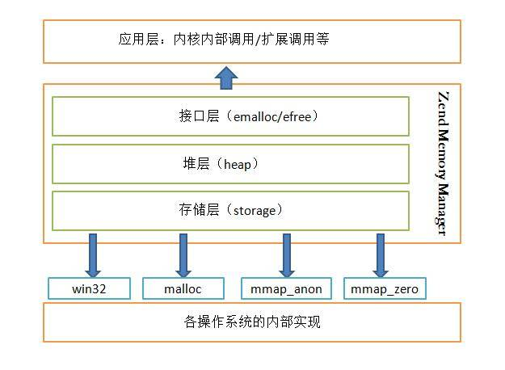

# 内存管理概述

某个意义上讲，资源总是有限的，计算机资源也是如此，衡量一个计算机处理能力的指标有很多，根据不同的应用需要也会有不同的指标，比如3D游戏对显卡的性能有要求，而Web服务器对吞吐量及响应时间有要求，通常CPU、内存及硬盘的读取和计算速度具有决定性的作用，在同一时刻这些资源是有限的，正是因为有限我们才需要合理的利用他们。

## 1 操作系统的内存管理

当计算机的电源被打开之后，不管你使用的是什么操作系统，这些软件可能已经在使用内存了。这是由计算机的结构决定的，操作系统也是一种软件，只不过它是比较特殊的软件，管理计算机的所有资源，普通应用程序和操作系统的关系有点像老师和学生，老师通常管理一切，而学生的行为会受到老师或学校规定的限制，例如普通应用程序无法直接访问物理内存或者其他硬件资源。

操作系统直接管理着内存，所以操作系统也需要进行内存管理，内存管理是如此之重要，计算机中通常都有内存管理单元(MMU)用于处理CPU对内存的访问。

## 2 应用层的内存管理

由于计算机的内存由操作系统进行管理，所以普通应用程序是无法直接对内存进行访问的，应用程序只能向操作系统申请内存，通常的应用也是这么做的，在需要的时候通过类似malloc之类的库函数向操作系统申请内存，在一些对性能要求较高的应用场景下是需要频繁的使用和释放内存的，比如Web服务器，编程语言等，由于向操作系统申请内存空间会引发系统调用，系统调用和普通的应用层函数调用性能差别非常大，因为系统调用会将CPU从用户态切换到内核，因为涉及到物理内存的操作，只有操作系统才能进行，而这种切换的成本是非常大的，如果频繁的在内核态和用户态之间切换会产生性能问题。

鉴于系统调用的开销，一些对性能有要求的应用通常会自己在用户态进行内存管理，例如第一次申请稍大的内存留着备用，而使用完释放的内存并不是马上归还给操作系统，可以将内存进行复用，这样可以避免多次的内存申请和释放所带来的性能消耗。

PHP不需要显式的对内存进行管理，这些工作都由Zend引擎进行管理了。PHP内部有一个内存管理体系，它会自动将不再使用的内存垃圾进行释放，这部分的内容后面的小节会介绍到。

## 3 PHP内存获取与修改

## 3.1 调整PHP内存

PHP常见报错：`Fatal error: Allowed memory size of X bytes exhausted (tried to allocate Y bytes)`

上述报错为PHP运行超出内存，可查看php.ini配置

默认配置为：`memory_limit = 32M`，可自行进行修改，也可以通过`ini_set()`函数在脚本中添加如下代码

```php
<?php
ini_set("memory_limit", "128M");
```

## 3.2 获取当前脚本内存大小

获取目前PHP脚本所用的内存大小：`memory_get_usage()`
返回当前脚本到目前位置所占用的内存峰值：`memory_get_peak_usage()`

## 4 PHP内存管理

PHP的内存管理在ZEND内核中是以宏的形式作为接口提供给外部使用

## 4.1 内存管理分层模型



- 存储层（storage）
    - 存储层通过 malloc()、mmap() 等函数向系统真正的申请内存，并通过 free() 函数释放所申请的内存
    - 存储层通常申请的内存块都比较大，这里申请的内存大并不是指storage层结构所需要的内存大，只是堆层通过调用存储层的分配方法时，其以大块大块的方式申请的内存，存储层的作用是将内存分配的方式对堆层透明化
- 堆层（heap）
- 接口层（emalloc/efree） 


前面的章节有介绍到引用计数，函数表，符号表，常量表等。当我们明白这些信息都会占用内存的时候，我们可以有意的避免不必要的浪费内存，比如我们在项目中通常会使用autoload来避免一次性把不一定会使用的类包含进来，而这些信息是会占用内存的，如果我们及时把不再使用的变量unset掉之后_可能_会释放掉它所占用的空间，

前面之所以会说把变量unset掉时候_可能_会把它释放掉的原因是： 在PHP中为了避免不必要的内存复制，采用了引用计数和写时复制的技术， 所以这里unset只是将引用关系打破，如果还有其他变量指向该内存， 它所占用的内存还是不会被释放的。
当然这还有一种情况：出现循环引用，这个就得靠gc来处理了， 内存不会当时就是放，只有在gc环节才会被释放。

后面的章节主要介绍PHP在运行时的内存使用和管理细节。这也能帮助我们写出更为内存友好的PHP代码。