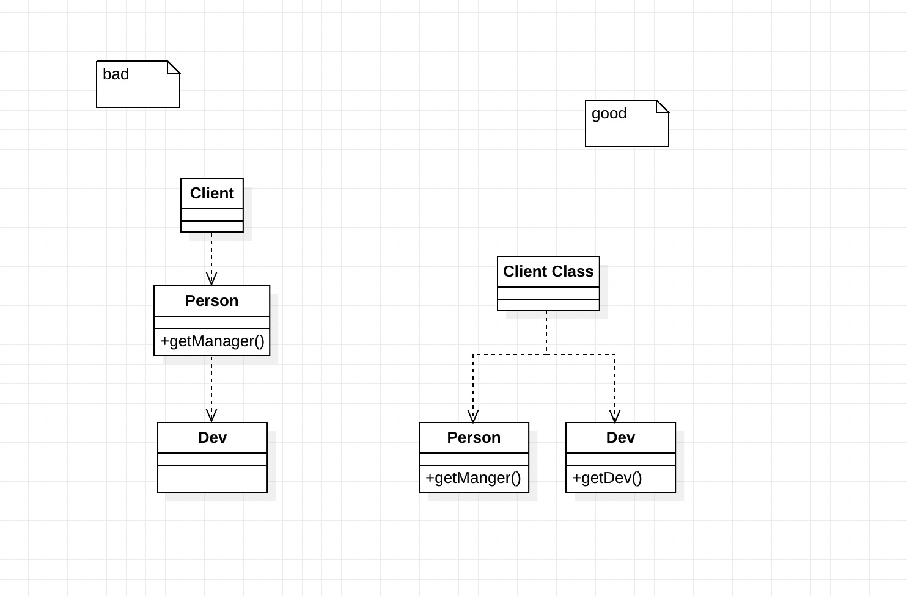
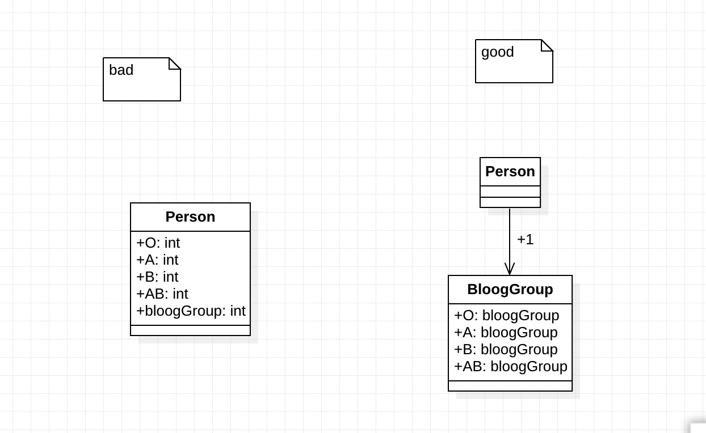
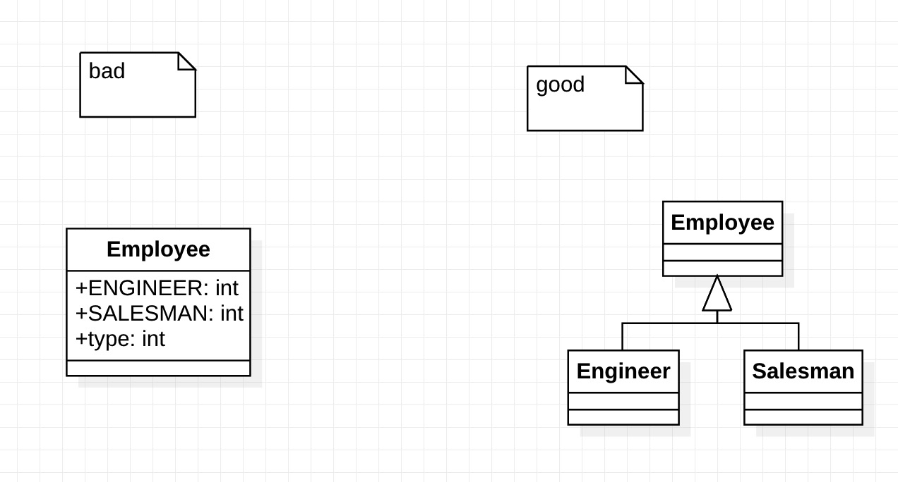
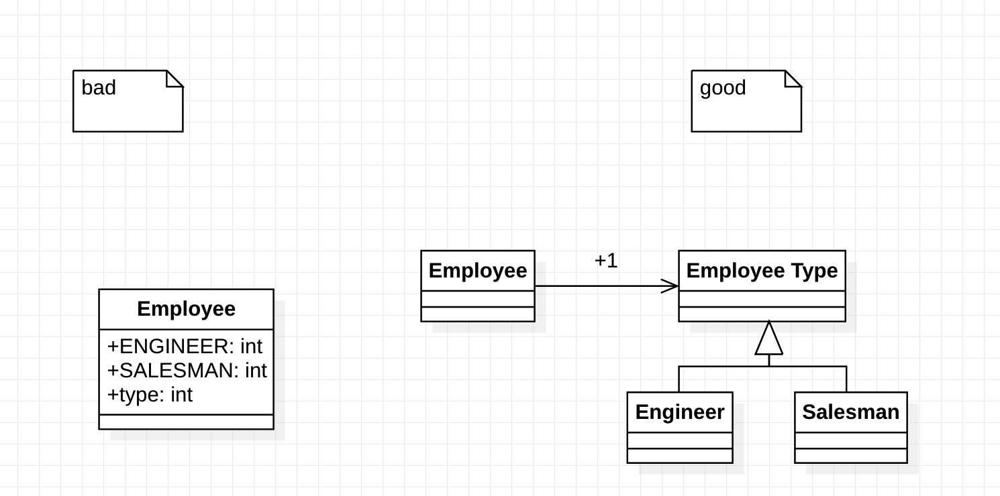

# 重构改善既有代码的设计

## 重构原则

### 重构定义
​ 在不改变软件可观察行为的前提下改善其内部结构

### 为何重构

1. 更容易理解，重新安排结构使得自己的理解层次更高
2. 找到bug 将新理解反馈时可找到旧时错误假设等
3. 提高编程速度 良好的设计是快速开发的根本

### 何时重构

1. 三次法则
    - 第一次做某件事时只管做；
    - 第二次做类似的事会产生反感，但无论如何还是可以去做；
    - 第三次再做类似的事，就应该重构。

2. 添加功能时重构 若原本的设计无法帮助我轻松添加我需要的新特性
3. 修补错误时重构 此时重构是为了可读性。重构可加深自己理解，此时重构能帮助找出bug。
4. 复审代码时重构 此处略code review的各种好处

### 何时不该重构

1. 代码中满是错误，重写 更快
2. 项目已近最后期限 也应当避免重构。重构赢得的生产力只在最后期限后才能体现。

## 重构与设计

- 重构与设计彼此互补。
- 若是没有重构，预先设计必须正确无误，这压力太大。
- 如果选择重构，仍然可以预先设计，但是不必找出完全正确的解决方案，而是足够合理的解决方案。

## 重构与性能

### 三种方法

- 时间预算法 写出可调的代码并在当时便修改到特定要求
- 持续关注法 做任何事都设法保持系统高性能实际性价比低。由于性能大半时间都费在一小半代码上，如果一视同仁所有代码，90%优化工作是白费劲。
- 在性能优化阶段调整 省去上一个法子的90%工作。找出性能热点后再使用持续关注法。

### 代码的坏味道

#### 重复代码(Duplicated Code)

解决方案：

- 提炼函数 (适用同一类内发现重复）
- 字段上移 （适用两个子类间发现重复，提到父类）
- 塑造模板函数 （两个子类有相似处但不同时适用）
- 替换算法 （发现有些函数以不同的算法做相同的事）
- 提炼类 (两个不相关类出现重复，则提出一个新类)

#### 过长函数(Long Method)

解决方案：

- 提炼函数（如果把很多参数和临时变量都当做参数传入，则会导致可读性下降，此时可以运用下面的方法）
- 以查询取代临时变量
- 引入参数对象（如果已经这么做了还有太多临时变量和参数）
- 以函数对象取代函数（条件表达式和循环也是提炼的信号）
- 分解条件表达式

#### 过大的类(Large Class)

解决方案：

- 提炼类（将几个变量提取到新类内）
- 提炼子类
- 提炼接口帮助看清如何分解类

#### 过长参数列(Long Parameter List)

- 以函数取代参数
- 保持对象完整（若是参数缺乏合理对象归属）
- 引入参数对象

#### 发散式变化(Divergent Change)

- 如果某个类经常因为不同原因在不同方向上产生变化，即产生了发散式变化。
- 应当找出特定原因，然后运用提炼类

#### 霰弹式修改(Shotgun Surgery)

每遇到某种变化，都需要在许多不同类做出许多小修改

- 搬移函数
- 搬移字段（把需要修改的代码放进一个类）
- 将类内联化

#### 依恋情结(Feature Envy)

函数对某个类的兴趣高过自己所处类的兴趣

- 当某个函数需要从另一个对象调用半打取值，则使用 搬移函数
- 若函数只有一部分受这种依恋之苦，用 提炼函数 后再用 搬移函数

#### 数据泥团(Data Clumps)

相同的若干项数据出现在不同地方，这些绑在一起出现的数据应该有属于它们自己的对象

- 提炼类
- 引入参数对象
- 保持对象完整

#### 基本类型偏执(Private Obsession)

很多人不愿意在小任务上运用小对象

- 以对象取代数据值
- 如果要替换的数据是类型码,并不影响行为则 以类取代类型码Replace Type Code with Class
- 若有与类型码相关的条件表达式，可运用 以子类取代类型码或 以State/Strategy取代类型码
- 若有一组被放在一起的字段则
- 提炼类
- 引入参数对象
- 以对象取代数据

#### switch惊悚现身(Switch Statements)

switch语句会在很多地方重复出现，一改则需全改

- 用提炼函数（将switch提炼到单独函数中，再搬移函数将它搬移到需要多态的类里，这时候必须用以子类取代类型码或，以State/Strategy取代类型码，这样就可以运用以多态取代条件表达式了）
- 如果只是在单一函数中，不用多态，用以明确函数取代参数
- 如果选择条件之一是null，试试 引入Null对象

#### 平行继承体系(Parallel Inheritance Hierarchies)

- 当你为某一个类增加子类时，也必须为另一个类相应增加一个类
- 让一个集成体系的实例引用另一个继承体系的实例。再使用 搬移函数 和 搬移字段

#### 冗赘类(Lazy Class)

- 如果一个类不值得存在，那就让它消失
- 折叠继承体系
- 没用的组件用将类内联化

#### 夸夸其谈的未来性(Speculative Generality)

- 预留的无用的抽象类，无用的抽象参数
- 折叠继承体系和将类内联化
- 移除参数
- 函数名有多余的抽象意味函数改名

#### 令人迷惑的暂时字段(Temporary Field)

- 类中某个字段只为某些特殊情况而设置
- 提炼类
- 引入Null对象

#### 过度耦合的消息链(Message Chains)

- 用户向一个对象请求另一个对象，然后再向后者请求另一个对象……
- 隐藏“委托关系”

#### 中间人(Middle Man)

- 无用的委托，过多的中间层
- 移除中间人
- 内联函数
- 以继承取代委托

#### 狎昵关系(Inappropriate Intimacy)

- 两个类过于亲密，一个类过于关注另一个类的成员
- 先用搬移函数和搬移字段划清界限
- 再将双向关联改为单向关联让一个类对另一个斩情丝
- 实在太关联，先提炼类
- 尝试用隐藏“委托关系”让另一个类为它们传递

#### 异曲同工的类(Alternative Classes with Different Interfaces)

- 不同名字的类或函数，做相同的事
- 函数改名
- 搬移函数
- 提炼超类

#### 不完美的库类(Incomplete Library Class)

- 类库设计不可能完美
- 只想修改一两个函数 引入外加函数
- 要添加一大堆额外行为则 引入本地扩展

#### 纯数据类(Data Class)

- 一个类拥有一些字段以及用于访问这些字段的函数，除此之外一无长物
- 尽早封装被其他类细索操控的字段封装字段
- 内含容器类字段，没封装则用 封装集合
- 不该被其他类修改的字段用移除设值函数
- 找到其他类使用取值/设值的点，用 搬移函数 和 提炼函数
- 之后就可以用隐藏函数 把这些取值/设值隐藏了
- 被拒绝的遗赠(Refused Bequest)：子类不想继承超类所有的函数和数据，只想挑几样来玩
- 为这个子类建一个兄弟类，再用 函数下移 和 字段下移 把用不到的函数下推给那个兄弟
- 子类复用超类行为，又不支持超类接口，坏代码味道更浓。如果不愿意继承接口，不要胡乱修改继承体系，应当用以委托取代继承

#### 过多的注释(Comments)

- 函数改名
- 搬移函数
- 引入断言

## 重新组织函数

### 提炼函数（Extract Method）

你有一段代码可以被组织在一起并独立出来。将这段代码放进一个独立函数中，并将函数名称解释该函数的用途

#### 内联函数（Inline Method）

一个函数的本体与名称同样清楚易懂。在函数调用点插入函数本体，然后移除该函数。

```java
// bad
int getRaging() {
    return (moreThanFiveLateDeliveries()) ? 2 : 1;
}

boolean moreThanFiveLateDeliveries（） {
    return numberOfLateDeliveries > 5;
}

// good
int getRaging() {
    return numberOfLateDeliveries > 5 ? 2 : 1;
}
```

#### 内联临时变量（Inline Temp）

你有一个临时变量，只被一个简单表达式赋值一次，而它妨碍了其他重构手法。将所有对该变量的引用动作，替换为对它赋值的那个表达式自身。

#### 以查询取代临时变量（Replace Temp with Query）

你的程序以一个临时变量保存某一表达式的运算结果。将这个表达式提炼到一个独立函数中。将这个临时变量的所有引用点替换为对新函数的调用。此后，新函数就可被其他函数使用。

#### 引入解释性变量（Introduce Explaining Variable）

你有一个复杂的表达式。将该复杂表达式（或其中一部分）的结果放进一个临时变量，以此变量名称来解释表达式用途。

#### 分解临时变量（Split Temporary Variable）

你的程序有某个临时变量被赋值过一次，它既不是循环变量，也不被用于收集计算结果。针对每次赋值，创造一个独立、对应的临时变量。

#### 移除对参数的赋值（Remove Assignments Parameters）

代码对一个参数进行赋值。以一个临时变量取代参数的位置。

#### 以函数对象取代函数（Replace Method with Method Object）

你有一个大型函数，其中对局部变量的使用使你无法采用Extract Method。将这个函数放进一个单独对象中，如此一来局部变量就成了对象内的字段。然后你可以在同一个对象中将这个大型函数分解为多个小型函数。

#### 替换算法（Substitute Algorithm）

你想要把某个算法替换为另一个更清晰的算法。将函数本体替换为另一个算法。

### 在对象间搬移特性

#### 搬移函数（Move Method）

你的程序中，有个函数与其所驻之外的另一个类进行更多交流：调用后者，或被后者调用。在该函数最常引用的类中建立一个有着类似行为的新函数。将旧函数变成一个单纯的委托函数，或是将旧函数完全移除。

#### 搬移字段（Move Field）

你的程序中，某个字段被其所驻类之外的另一个类更多地用到。在目标类新建一个字段，修改源字段的所有用户，令它们改用新字段。

#### 提炼类（Extract Class）

某个类做了应该有两个类做的事。建立一个新类，将相关的字段和函数从旧类搬移到新类。

#### 将类内联化（Inline Class）

某个类没有做太多事情。将这个类的所有特性搬移到另一个类中，然后移除原类。

#### 隐藏“委托关系”（Hide Delegate）

客户通过一个委托来调用另一个对象。在服务类上建立客户所需的所有函数，用以隐藏委托关系。

#### 移除中间人（Remove Middle Man）

某个类做了过多的简单委托动作。让客户直接调用受托类。



#### 引入外加函数（Introduce Foreign Method）

你需要为提供服务的类增加一个函数，但你无法修改这个类。在客户类中建立一个函数，并以第一参数形式传入一个服务类实例。

#### 引入本地扩展（Introduce Local Extension）

你需要为服务类提供一些额外函数，但你无法修改这个类。建立一个新类，使它包含这些额外函数。让这个扩展品成为源类的子类或包装类。

### 重新组织数据

#### 自封装字段（Self Encapsulate Field）

你直接访问一个字段，但与字段之间的耦合关系逐渐变得笨拙。为这个字段建立取值/设值函数，并且只以这些函数来访问字段。

#### 以对象取代数据值（Replace Data Value with Object）

你有一个数据项，需要与其他数据和行为一起使用才有意义。将数据项变成对象。

#### 将值对象改为引用对象（Change Value to Reference）

你从一个类衍生出许多彼此相等的实例，希望将它们替换为同一个对象。将这个值对象变成引用对象。

#### 将引用对象改为值对象（Change Reference to Value）

你有一个引用对象，很小且不可变，而且不易管理。将它变成一个值对象。

#### 以对象取代数据（Replace Array with Object）

你有一个数组，其中的元素各自代表不同的东西。以对象替换数组，对于数组中的每个元素，以一个字段来表示。

#### 复制“被监视数据”（Duplicate Observed Data）

你有一些领域数据置身GUI控件中，而领域函数需要访问这些数据。将该数据复制到一个领域对象中。建立一个Observe模式，用以同步领域对象和GUI对象内的重复数据。

#### 将单向关联改为双向关联（Change Unidirectional Association to Bidirectional）

两个类都需要使用对方特性，但其间只有一条单向链接。添加一个反向指针，并使修改函数能够同时更新两条链接。

#### 将双向关联改为单向关联（Change Bidirectional Association to Unidirectional）

两个类之间有双向关联，但其中一个类如今不再需要另一个类的特性。去除不必要的关联。

#### 以字面常量取代魔法数（Replace Magic Number with Symbolic Constant）

你有一个字面数值，带有特别含义。创造一个常量，根据其意义为它命名，并将上述的字面数值替换为这个常量。

#### 封装字段（Encapsulate Field）

你的类中存在一个public字段。将它声明为private，并提供相应的访问函数。

#### 封装集合（Encapsulate Collection）

有个函数返回一个集合。让这个函数返回该集合的一个只读副本，并在这个类中提供添加/移除集合元素的函数。

#### 以数据类取代记录（Replace Record with Data Class）

你需要面对传统编程环境中的记录结构。为该记录创建一个“哑”数据对象。

#### 以类取代类型码（Replace Type Code with Class）

类之中有一个数值类行码，但它并不影响类的行为。以一个新的类替换该数值类型码。



#### 以子类取代类型码（Replace Type Code with Subclass）

你有一个不可变的类型码，它会影响类的行为。以子类取代这个类型码。



#### 以State/Strategy取代类型码（Replace Type Code with State/Strategy）

你有一个类型码，它会影响类的行为，但你无法通过继承手法消除它。以状态对象取代类型码。



#### 以字段取代子类（Replace Subclass with Fields）

你的各个子类的唯一差别只在“返回常量数据”的函数身上。修改这些函数，使他么返回超类中的某个（新增）字段，然后销毁子类。

### 简化条件表达式

#### 分解条件表达式（Decompose Conditional）

你有一个复杂的条件（if-then-else）语句。从if、then、else三分段落中分别提炼出独立函数。

#### 合并条件表达式（Consolidate Conditional Expression）

你有一系列条件测试，都得到相同结果。将这些测试合并为一个条件表达式，并将这个条件表达式提炼成为一个独立函数。

#### 合并重复的条件片段（Consolidate Duplicate Conditional Fragments）

在条件表达式的每个分支上有着相同的一段代码。将这段重复的代码搬移到条件表达式之外。

#### 移除控制标记（Remove Control Flag）

在一系列布尔表达式中，某个变量带有“控制标记”的作用。以break语句或return语句取代控制标记。

#### 以switch语句取代嵌套条件表达式（Replace nested Conditional with Guard Clauses)

函数中的条件逻辑使人难以看清正常的执行路径。使用卫语句表现所有的特殊情况。

#### 以多态取代条件表达式（Replace Conditional with Polymorphism）

你手上有个条件表达式，它根据对象类型的不同选择不同的行为。将这个条件表达式的每个分支放进一个子类内的覆写函数中，然后将原始函数声明为抽象函数。

#### 引入Null对象（Introduce Null Object）

你需要再三检查某对象是否为null。将null值替换为null对象。
image

#### 引入断言（Introduce Assertion）

某一段代码需要对程序状态做出某种假设。以断言明确表现这种假设。

### 简化函数调用

#### 函数改名（Rename Method）

函数的名称未能揭示函数的用途。修改函数的名称。

#### 添加参数（Add Parameter）

某个函数需要从调用端得到更多信息。为此函数添加一个对象参数，让该对象带进函数所需信息。

#### 移除参数（Remove Parameter）

函数本体不再需要某个参数。将该参数去除。

#### 将查询函数和修改函数分离（Separate Query from Modifier）

某个函数既返回对象状态值，又修改对象状态。建立两个不同的函数，其中一个负责查询，另一个负责修改。

#### 令函数携带参数（Parameterize Method）

若干函数做了类似的工作，但在函数本体中却包含了不同的值。建立单一函数，以参数表达那些不同的值。

#### 以明确函数取代参数（Replace Parameter with Explicit Methods）

你有一个函数，其中完全取决于参数值而采取不同行为。针对该参数的每一个可能值，建立一个独立函数。

#### 保持对象完整（Preserve Whole Object）

你从某个对象中取出若干值，将它们作为某一次函数调用时的参数。改为传递整个对象。

#### 以函数取代参数（Replace Parameter with Methods）

对象调用某个函数，并将所得结果作为参数，传递给另一个函数。而接受该参数的函数本身也能够调用前一个函数。让参数接受者去除该项参数，并直接调用前一个函数。

```java
// bad
int basePrice = _quantity * _itemPrice;
discountLevel = getDiscountLevel()
double finalPrice = discountedPrice (basePrice, discountLevel);

// good
int basePrice = _quantity * _itemPrice;
double finalPrice = discountedPrice (basePrice);
```

#### 引入参数对象（Introduce Parameter Object）

某些参数总是很自然地同时出现。以一个对象取代这些参数。

#### 移除设值函数（Remove Setting Method）

类中的某个字段应该在对象创建时被设值，然后就不再改变。去掉该字段的所有设值函数。

#### 隐藏函数（Hide Method）

有一个函数，从来没有被其他任何类用到。将这个函数修改为private。

#### 以工厂函数取代构造函数（Replace Constructor with Factory Method）

你希望在创建对象时不仅仅是做简单的构建动作。将构建函数替换为工厂函数。

#### 封装向下转型（Encapsulate Downcast）

某个函数返回的对象，需要由函数调用者执行向下转型。将向下转型动作移到函数中。

#### 以异常取代错误码（Replace Error Code with Exception）

某个函数返回一个特定的代码，用以表示某种错误情况。改用异常。

#### 以测试取代异常（Replace Exception with Test）

面对一个调用者可以预先检查的条件，你抛出了一个异常。修改调用者，使它在调用函数之前先做检查。

### 处理概括关系

#### 字段上移（Pull Up Field）

两个子类拥有相同的字段。将该字段移至超类。

#### 函数上移（Pull Up Method）

有些函数，在各个子类中产生完全相同的结果。将该函数移至超类。

#### 构造函数本体上移（Pull Up Constructor Body）

你在各个子类中拥有一些构造函数，他们的本体几乎完全一致。在超类中新建一个构造函数，并在子类构造函数中调用它。

#### 函数下移（Push Down Method）

超类中的某个函数只与部分（而非全部）子类有关。将这个函数移到相关的那些子类去。

#### 字段下移（Push Down Field）

超类中的某个字段只被部分（而非全部）子类用到。将这个字段移到需要它的那些子类去。

#### 提炼子类（Extract Subclass）

类中的某些特性只被某些（而非全部）实例用到。新建一个子类，将上面所说的那一部分特性移到子类中。

#### 提炼超类（Extract Superclass）

两个类有相似特性。为这两个类建立一个超类，将相同特性移至超类。

#### 提炼接口（Extract Interface）

若干客户使用类接口中的同一子集，或者两个类的接口有部分相同。将相同的子集提炼到一个独立接口中。

#### 折叠继承体系（Collapse Hierarchy）

超类和子类之间无太大差别。将它们合为一体。

#### 塑造模板函数（Form TemPlate Method）

你有一些子类，其中相应的某些函数以相同顺序执行类似的操作，但各个操作的细节上所有不同。将这些操作分别放进独立函数中，并保持它们都有相同的签名，于是原函数也就变得相同了。然后将原函数上移至超类。

#### 以委托取代继承（Replace Inheritance with Delegation）

某个子类只使用超类接口中的一部分，或是根本不需要继承而来的数据。在子类中新建一个字段用以保存超类；调整子类函数令它改而委托超类；然后去掉两者之间的继承关系。

#### 以继承取代委托（Replace Delegation with Inheritance）

你在两个类之间使用委托关系，并经常为整个接口编写许多极简单的委托函数。让委托类来继承受托类。