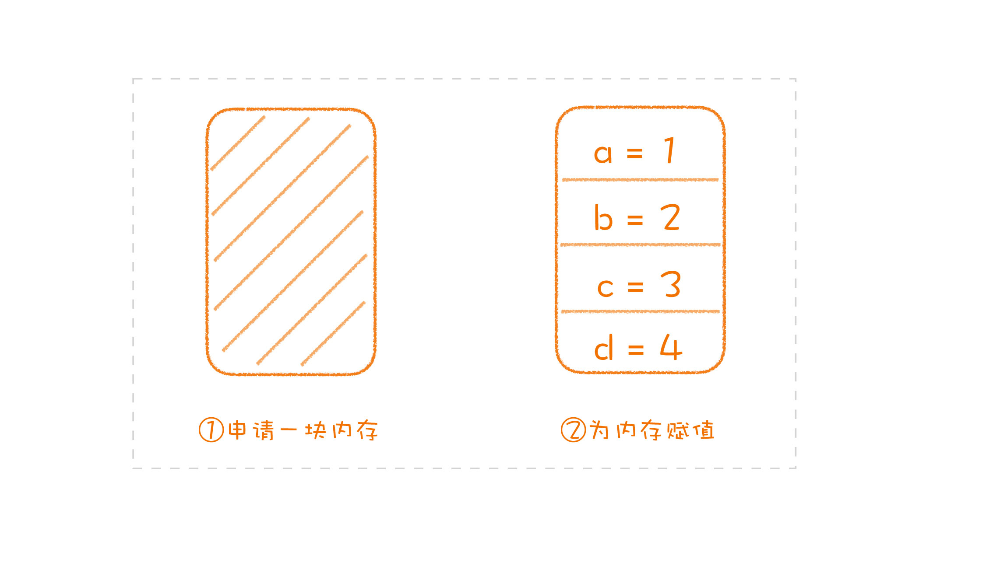

# 程序语言

## 语言模型

### 概述

可能遇到的问题：

* 面向对象用来组织程序是好，但我用的是 C 语言；
* 我用的是 C++，函数式编程的好，跟我有什么关系；
* 动态语言那些特性很好，可惜我用的是 Java；

Andrew Hunt 和 David Thomas 在《程序员修炼之道》（The Pragmatic Programmer）中给程序员们提了一项重要的建议：每年至少学习一门新语言。

程序设计语言本身也是一个软件，它也包含模型、接口和实现。而我们学习程序设计语言主要是为了学习程序设计语言提供的编程模型，比如：不同的程序组织方式，不同的控制结构等等。因为不同的编程模型会带给你不同的思考方式。

### 发展历程

~~~mermaid
graph LR;
  二进制 --> 汇编 --> 高级程序语言
~~~

汇编解决的问题：将二进制串变为ADD、MOV等指令，提高可读性
高级程序语言：语言组织、内存管理

### 学习方式

学习程序设计语言其实就是要学习语言提供的编程模型

1. 语言的发展就是一个互相学习和借鉴的过程
2. 一切语法都是语法糖

举例：

* C 语言提供了对汇编指令直接的封装。
* C++ 先是提供了面向对象，后来又提供了泛型编程。
* Java 把内存管理从开发者面前去掉了，后来引入的 Annotation 可以进行声明式编程。
* Ruby 提供了动态类型，以及由 Ruby on Rails 引导出的 DSL 风格。
* Scala 和 Clojure 提供了函数式编程。
* Rust 提供了新的内存管理方式，而 Libra 提供的 Move 语言则把它进一步抽象成了资源的概念。

**学习一门新的语言其实是为了学习他的编程模型，如果不提供新编程模型的语言是不值得刻意学习**

---

## 语言接口

如果你已经能够完成基本功能的开发，想让自己在编程水平上再进一步，成为一个更好的程序员，你就可以从封装程序库开始练习。因为想封装出一个好的程序库所需的能力，就是软件设计所需的能力。封装程序库，可以成为你软件设计进阶的发力点。

### 消除重复的程序库

所有的"糟粕"都是从重复指令开始，所以应该适当的"消除"重复程序库

### 语言设计就是程序库设计

C语言赋值操作，先申请内存，再进行赋值，这就是一个固定模式，所有的变量进行操作都需要进行这个操作

所以后期出现的一些新语言直接用new代替，如java。当调用new时就会先申请一块内存，然后调用对应类的构造函数

由于c语言没有这些特性，所以就通过程序库实现，而到了 C++ 和 Java 中，它成了语法。一旦变成了语法，它就成了语言的一部分，成为了一个特定的模型。

一个经过验证的模式最终变成了语言的一部分，而它的起点只是一个常见的用法：一个程序库。

### 总结

程序库最初只是为了消除重复。后来，逐渐有了标准库，然后有了大量的第三方库，进而发展出包管理器。

如果通用性足够好，一些经过大量实践验证过的程序库甚至会变成语言的语法，而一些语法解决得不够好的地方，又会出现新的程序库去探索新的解决方案。所以，语言设计就是程序库设计，程序库设计就是语言设计。二者相互促进，不断发展。

**核心**：提升软件设计能力，可以从编写程序库入手。

---

## 语言实现

做设计真正的地基，并不是程序设计语言，而是运行时，有了对于运行时的理解，我们甚至可以做出语言本身不支持的设计。

### 程序如何运行

通过找到主线，可以分析程序运行的整体流程