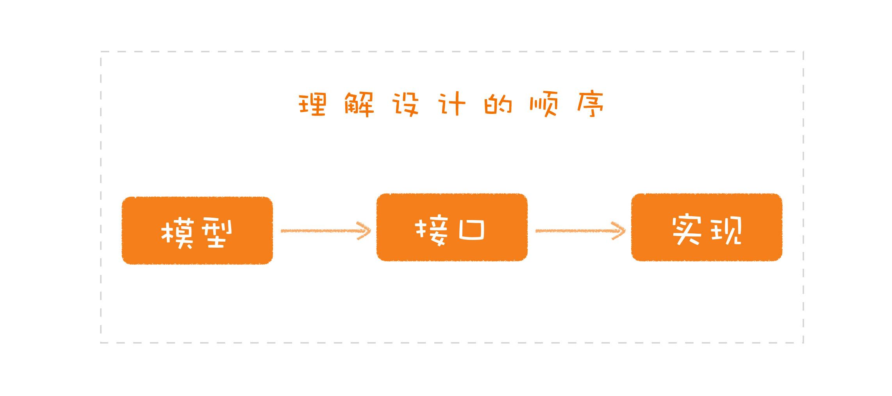
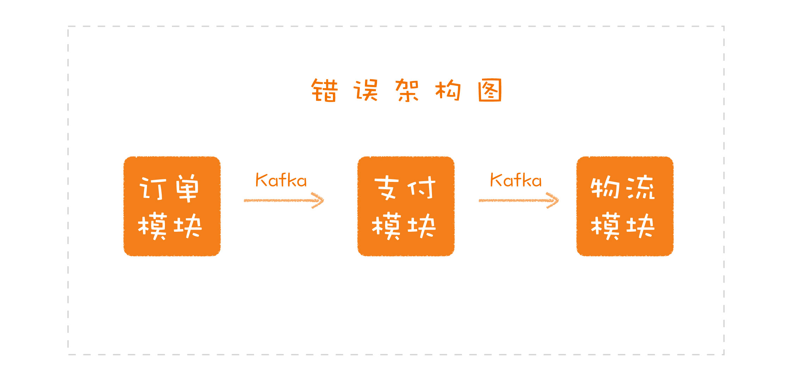

# 理论知识

## 如何了解软件设计

三个方面

* 模型
* 接口
* 实现

### 模型

一个软件的核心，也有人称之为抽象。理解一个设计中的模型，可以帮助我们建立起对这个软件整体的认知。

### 接口

它决定了软件通过怎样的方式，将模型提供的能力暴露出去。它是我们与这个软件交互的入口。

如：

* 程序库的API接口
* 工具软件的命令行接口
* 业务系统对外暴露的REST API
* ......

### 实现

指软件提供的模型和接口在内部是如何实现的，这是软件能力得以发挥的根基。

如：

* 业务系统收到一个请求之后，是把信息写到数据库，还是转发给另外的系统。
* 算法的实现，是选择调用与别人已有的程序库，还是需要自己实现一个特定的算法。
* 系统中的功能，哪些应该做成分布式的，哪些应该由一个中央节点统一处理。
* 业务处理，是应该做成单线程，还是多线程的。
* 当资源有竞争，是每个节点自己处理，还是交由一个中间件统一处理。
* 不同系统之间的连接，该采用哪种协议，是自己实现，还是找一个中间件。
* ......

### 三者之间的关系

由于三者之间的关注点不同，所以需要对其区分（模型、接口和实现），顺序应该先模型，再接口，最后是实现

### 业务实例分析

由于Kafka 的出现，就把实现层面的东西拉了进来。这样模型和实现就混淆在一起了，Kafka 只是实现这个功能时的一个技术选型，实现这段代码的时候，必须把 Kafka 相关的代码进行封装，不能在系统各处随意地调用，因为它属于实现，是可能被替换的。

### 操作系统实例分析

如果你去了解它的内部，就知道它有内存管理、进程调度、文件系统等模块。我们可以按照模型、接口和实现去理解每个模块，就以进程管理为例：

* 进程管理的核心模型就包括进程模型和调度算法；
* 它的接口就包括，进程的创建、销毁以及调度算法的触发等；
* 不同调度算法就是一个个具体的实现。

### HashMap实例分析

* 模型：HashMap
* 接口：get、put等
* 实现：原来是用标准的 HashMap 实现，后来则借鉴了红黑树

### 总结

* 模型，也可以称为抽象，是一个软件的核心部分，是这个系统与其它系统有所区别的关键，是我们理解整个软件设计最核心的部分。
* 接口，是通过怎样的方式将模型提供的能力暴露出去，是我们与这个软件交互的入口。
* 实现，就是软件提供的模型和接口在内部是如何实现的，是软件能力得以发挥的根基。
